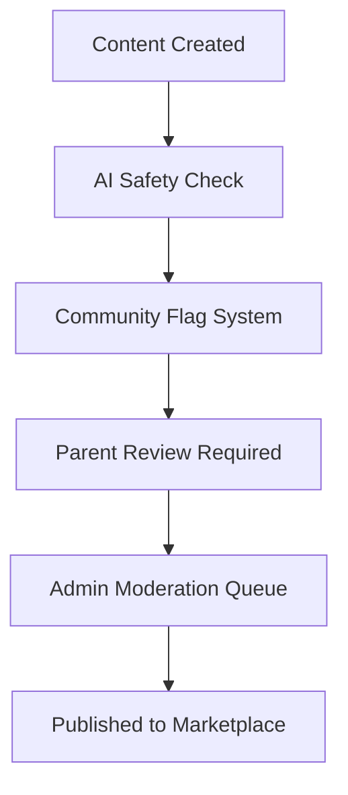

# Community Marketplace Expansion Strategy

## Executive Summary

Transform WonderNest's marketplace from a simple story distribution platform into a thriving creator economy that seamlessly blends human creativity with AI assistance, fostering both content creation and community engagement.

## Current State vs. Future Vision

### Current State (Discovered Architecture)
- Basic story marketplace (`marketplace_listings`, `story_purchases`)
- Simple rating system (`marketplace_reviews`)
- Traditional seller-buyer model
- Limited to complete stories

### Future Vision
- **Hybrid Creation Economy**: Human creators, AI tools, and collaborative creation
- **Multi-Asset Marketplace**: Stories, prompts, images, characters, themes
- **Creator Tools Platform**: Empower parents to become content creators
- **Educational Ecosystem**: Curriculum-aligned content with learning outcomes

## Phase 1: Foundation (Months 1-2)

### 1.1 AI Content Integration

**Objective**: Seamlessly integrate AI-generated content into existing marketplace

**Implementation**:
```sql
-- Already defined in migration
-- Use content_source field to differentiate
-- Implement attribution system
```

**User Experience**:
- Clear labeling: "AI Generated", "AI Assisted", "Human Created"
- Quality indicators based on parent reviews
- Safety badges for verified content

### 1.2 Creator Attribution System

**Features**:
- Creator profiles with contribution history
- Mixed attribution for collaborative works
- Transparent revenue sharing

**Creator Profile Structure**:
```json
{
  "creator_id": "uuid",
  "display_name": "StorytellerMom",
  "creator_type": "parent",
  "verified": true,
  "specialties": ["bedtime stories", "adventure"],
  "ai_tools_used": ["prompt_templates", "image_generation"],
  "total_stories": 45,
  "ai_assisted_stories": 12,
  "rating": 4.7,
  "badges": ["top_creator", "ai_pioneer", "safety_champion"]
}
```

## Phase 2: Prompt Template Marketplace (Months 3-4)

### 2.1 Template as a Product

**Value Proposition**: Sell the ability to create infinite personalized stories

**Template Categories**:
1. **Story Frameworks**
   - Basic plot structures
   - Genre templates (adventure, educational, moral)
   - Age-appropriate narratives

2. **Educational Templates**
   - Curriculum-aligned stories
   - Skill-building narratives
   - STEM story generators

3. **Personalization Templates**
   - Birthday stories
   - Achievement celebrations
   - Family tradition stories

### 2.2 Template Pricing Models

```kotlin
enum class TemplatePricingModel {
    ONE_TIME_PURCHASE,      // Buy once, use forever
    USAGE_BASED,           // Pay per generation
    SUBSCRIPTION_INCLUDED,  // Part of premium tier
    FREEMIUM              // Basic free, advanced features paid
}
```

**Revenue Sharing**:
- Template creator: 70%
- Platform: 25%
- Original content creator (if derivative): 5%

### 2.3 Template Quality Metrics

```sql
-- Track template performance
CREATE TABLE template_quality_metrics (
    template_id UUID,
    successful_generation_rate DECIMAL(5,2),
    average_parent_approval_rate DECIMAL(5,2),
    average_child_engagement_score DECIMAL(5,2),
    educational_value_score DECIMAL(5,2),
    safety_score DECIMAL(5,2)
);
```

## Phase 3: Community Features (Months 5-6)

### 3.1 Collaborative Story Creation

**Features**:
1. **Story Jams**
   - Time-limited collaborative events
   - Theme-based challenges
   - Community voting

2. **Remix Culture**
   - Fork and modify existing stories
   - Attribution chains
   - Remix tournaments

3. **Co-Creation Tools**
   - Multi-parent story building
   - Round-robin storytelling
   - Illustration collaboration

### 3.2 Social Features

```kotlin
data class CommunityFeatures(
    val following: List<CreatorId>,
    val collections: List<StoryCollection>,
    val recommendations: PersonalizedFeed,
    val achievements: List<Badge>,
    val contributionScore: Int
)
```

**Engagement Mechanics**:
- Follow favorite creators
- Curated story collections
- Weekly featured creators
- Achievement system

### 3.3 Educational Community

**School Integration**:
- Teacher accounts with bulk licensing
- Classroom story creation tools
- Curriculum mapping
- Student progress tracking

**Parent Educator Network**:
- Share educational templates
- Peer review system
- Best practices forum
- Webinar series

## Phase 4: Advanced Monetization (Months 7-8)

### 4.1 Tiered Subscription Model

```kotlin
enum class SubscriptionTier {
    FREE,           // 3 AI generations/month, basic templates
    FAMILY,         // 50 AI generations/month, all templates
    CREATOR,        // Unlimited generations, selling tools
    EDUCATOR,       // Classroom tools, bulk generations
    ENTERPRISE      // School/district licensing
}
```

### 4.2 Creator Monetization Tools

**Revenue Streams**:
1. **Direct Sales**
   - Stories
   - Templates
   - Image packs
   - Character libraries

2. **Subscriptions**
   - Creator channels
   - Exclusive content
   - Early access

3. **Services**
   - Custom story commissions
   - Personalization services
   - Educational consulting

### 4.3 Virtual Goods Economy

```sql
-- Virtual currency for micro-transactions
CREATE TABLE virtual_currency (
    user_id UUID,
    wonder_coins INTEGER DEFAULT 0,
    earned_coins INTEGER DEFAULT 0,
    purchased_coins INTEGER DEFAULT 0
);

-- Redeemable for:
-- - AI generations
-- - Premium templates
-- - Special effects
-- - Character unlocks
```

## Phase 5: Quality & Trust Systems

### 5.1 Multi-Layer Quality Assurance



### 5.2 Trust Indicators

**Visible Metrics**:
- Safety score (1-5 shields)
- Educational value (1-5 stars)
- Age appropriateness badge
- Parent approval rate
- Child engagement score

### 5.3 Content Certification Program

```kotlin
data class ContentCertification(
    val certificationLevel: CertificationLevel,
    val verifiedBy: AdminId,
    val criteria: List<QualityCriteria>,
    val validUntil: Date
)

enum class CertificationLevel {
    WONDERNEST_VERIFIED,
    EDUCATOR_APPROVED,
    CHILD_PSYCHOLOGIST_REVIEWED,
    CURRICULUM_ALIGNED
}
```

## Phase 6: Analytics & Insights

### 6.1 Creator Dashboard

**Metrics Provided**:
```json
{
  "content_performance": {
    "views": 5432,
    "purchases": 234,
    "engagement_rate": 0.73,
    "completion_rate": 0.89,
    "vocabulary_learned": ["courage", "friendship"]
  },
  "audience_insights": {
    "age_distribution": {"3-5": 45, "6-8": 40, "9-12": 15},
    "peak_reading_times": ["7pm-8pm", "2pm-3pm"],
    "geographic_distribution": {...}
  },
  "revenue_analytics": {
    "total_earnings": 342.50,
    "top_earning_content": [...],
    "conversion_rate": 0.043
  }
}
```

### 6.2 Parent Insights

**Child Development Tracking**:
- Stories consumed vs. vocabulary growth
- Theme preferences evolution
- Reading speed improvements
- Comprehension scores

### 6.3 Platform Analytics

```sql
-- Marketplace health metrics
CREATE VIEW marketplace_health AS
SELECT 
    COUNT(DISTINCT creator_id) as active_creators,
    COUNT(DISTINCT buyer_id) as active_buyers,
    AVG(rating) as average_content_rating,
    SUM(price_paid) as total_revenue,
    COUNT(*) FILTER (WHERE content_source = 'ai_generated') / COUNT(*)::DECIMAL as ai_content_ratio
FROM marketplace_listings
JOIN story_purchases ON listing_id = listings.id
WHERE purchased_at > NOW() - INTERVAL '30 days';
```

## Implementation Roadmap

### Technical Prerequisites

1. **Infrastructure**
   - Scalable AI generation pipeline
   - CDN for content delivery
   - Real-time collaboration system
   - Payment processing expansion

2. **AI Capabilities**
   - Multiple LLM providers
   - Image generation integration
   - Voice synthesis (future)
   - Translation services

3. **Safety Systems**
   - Automated content moderation
   - Parent approval workflows
   - Community reporting
   - Appeal process

### Go-to-Market Strategy

#### Phase 1 Launch (Soft Launch)
- **Target**: 100 power-user families
- **Focus**: AI story generation, basic sharing
- **Success Metric**: 80% parent approval rate

#### Phase 2 Launch (Creator Beta)
- **Target**: 500 creator parents
- **Focus**: Template marketplace
- **Success Metric**: 50 templates created

#### Phase 3 Launch (Public)
- **Target**: All users
- **Focus**: Full marketplace
- **Success Metric**: 1000 monthly active creators

### Marketing Approach

1. **Creator Acquisition**
   - Parent blogger partnerships
   - Teacher influencer program
   - Writing community outreach

2. **Quality Content Seeding**
   - Commission high-quality templates
   - Partner with children's authors
   - Educational institution partnerships

3. **Community Building**
   - Weekly story challenges
   - Creator spotlights
   - Virtual storytelling events

## Success Metrics

### Short-term (3 months)
- 500 AI stories generated
- 100 shared to marketplace
- 50 prompt templates created
- 80% parent satisfaction

### Medium-term (6 months)
- 5,000 monthly active creators
- $10,000 monthly marketplace revenue
- 500 premium template sales
- 85% safety approval rate

### Long-term (12 months)
- 50,000 stories in marketplace
- 20% AI-generated content
- $100,000 monthly revenue
- 5 enterprise education contracts

## Risk Mitigation

### Content Quality Risks

**Risk**: AI generates poor quality stories
**Mitigation**: 
- Multi-model approach
- Human-in-the-loop editing
- Community quality voting
- Continuous model fine-tuning

### Safety Risks

**Risk**: Inappropriate content reaches children
**Mitigation**:
- Mandatory parent preview
- Multi-layer safety checks
- Quick removal system
- Clear reporting mechanism

### Economic Risks

**Risk**: Race to bottom pricing
**Mitigation**:
- Quality-based ranking
- Minimum price floors
- Premium certification
- Value-added features

### Technical Risks

**Risk**: AI provider dependency
**Mitigation**:
- Multiple provider support
- Fallback mechanisms
- Local model options
- Cached content strategy

## Competitive Advantages

1. **First-Mover in AI + Child Safety**
   - Only platform combining AI generation with COPPA compliance
   - Patent-pending safety verification system

2. **Integrated Ecosystem**
   - Seamless flow from creation to consumption
   - Built-in child development tracking
   - Parent control at every step

3. **Community Network Effects**
   - More creators → better content → more users
   - Template improvements benefit all
   - Collaborative creation culture

4. **Educational Focus**
   - Curriculum alignment
   - Learning outcome tracking
   - Teacher tools

## Future Innovations

### Near-term (6-12 months)
- Voice narration generation
- Animated story elements
- AR story experiences
- Multi-language support

### Long-term (12-24 months)
- Video story generation
- Interactive choose-your-own adventures
- AI teaching assistants
- Personalized learning paths

### Experimental (24+ months)
- VR storytelling environments
- AI-powered story games
- Real-time collaborative worlds
- Blockchain content ownership

## Conclusion

The marketplace expansion strategy positions WonderNest as the premier platform for safe, educational, AI-enhanced children's content. By empowering parents to become creators while maintaining strict safety standards, we create a sustainable ecosystem that benefits families, educators, and content creators alike.

The phased approach allows for careful scaling while maintaining quality and safety, with clear metrics for success at each stage. The combination of human creativity and AI assistance creates unique value that competitors cannot easily replicate.

## Appendix: Financial Projections

### Revenue Model

```python
# Monthly Revenue Projection (Month 12)
subscription_revenue = 10000 * 9.99  # Family tier
creator_revenue = 500 * 19.99        # Creator tier
marketplace_commission = 100000 * 0.25  # 25% of sales
enterprise_licenses = 5 * 5000       # School contracts

total_monthly_revenue = 159,850
annual_run_rate = 1,918,200
```

### Cost Structure

```python
# Monthly Costs (Month 12)
ai_api_costs = 50000 * 0.05         # Per generation
infrastructure = 10000              # AWS/GCP
moderation_team = 5 * 5000          # Human moderators
development_team = 8 * 15000        # Engineers
marketing = 20000                   # Acquisition

total_monthly_costs = 177,500
```

### Break-even Analysis

With current projections, marketplace reaches profitability at Month 14 with 15,000 active families and 1,000 active creators.