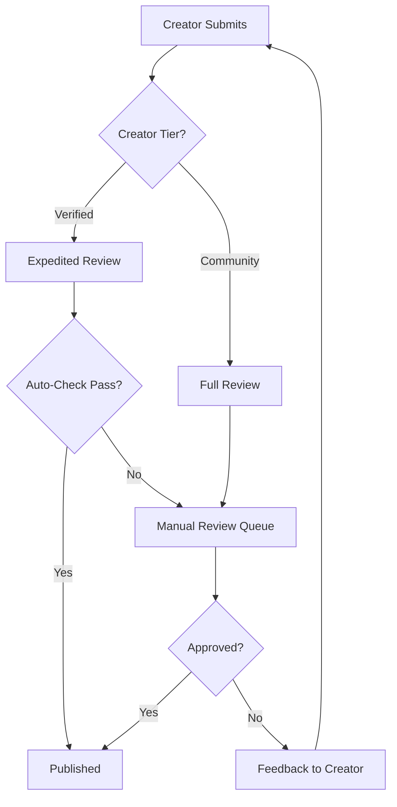

# WonderNest Content Creation Strategy

## Executive Summary
WonderNest's content creation ecosystem supports three distinct pathways for content generation, each serving different strategic objectives while maintaining platform quality and safety standards. This strategy prioritizes immediate marketplace seeding while building toward a sustainable creator economy.

## Strategic Goals
1. **Immediate (0-3 months)**: Enable rapid marketplace seeding through admin tools
2. **Short-term (3-6 months)**: Launch curated creator program with select partners
3. **Long-term (6-12 months)**: Enable parent-generated content with monetization options
4. **Vision (12+ months)**: Self-sustaining creator ecosystem with minimal platform intervention

## Content Creation Pathways

### Path 1: Admin Direct Creation (MVP Priority)
**Purpose**: Rapidly seed marketplace with high-quality content
**Timeline**: Immediate implementation
**Volume Goal**: 100+ content packs in first 90 days

#### Features & Capabilities
- **Bulk Import Tools**
  - CSV/JSON import for metadata
  - Batch file upload with automatic categorization
  - Template-based content pack creation
  - Auto-generation of thumbnails and previews
  
- **Content Sources**
  - Licensed educational content partnerships
  - Public domain educational materials
  - AI-generated educational content (with review)
  - Commissioned content from freelancers
  
- **Admin Workflows**
  - Quick publish without review process
  - "WonderNest Official" badge assignment
  - Bulk pricing and categorization tools
  - Content scheduling for timed releases
  
- **Quality Controls**
  - Internal style guide compliance checker
  - Educational alignment verification
  - Age-appropriateness automated scanning
  - COPPA compliance validation

#### Technical Requirements
```yaml
Admin Permissions:
  - content:bulk_upload
  - content:instant_publish
  - content:official_badge
  - marketplace:override_review

Database Tables:
  - content_packs (source: 'admin', review_status: 'approved')
  - admin_upload_batches (tracking bulk operations)
  - content_templates (reusable structures)
```

### Path 2: Content Creator Accounts (Phase 2)
**Purpose**: Build curated ecosystem of quality content creators
**Timeline**: Launch at 3 months with 10 pilot creators
**Volume Goal**: 50+ creator-generated packs per month by month 6

#### Creator Tiers & Permissions

##### Verified Creators (Invitation Only)
- **Selection Criteria**
  - Educational credentials or experience
  - Portfolio of existing educational content
  - Alignment with WonderNest values
  - Commitment to regular content creation
  
- **Capabilities**
  - Full content creation suite access
  - Direct marketplace publishing (with expedited review)
  - Analytics dashboard with detailed metrics
  - Revenue share: 70% creator / 30% platform
  - Marketing support and featuring
  
- **Requirements**
  - Background check completion
  - Content quality agreement
  - Minimum 2 content packs per month
  - Exclusive or priority release agreements

##### Community Creators (Application Based)
- **Selection Criteria**
  - Basic educational background
  - Sample content submission
  - Community endorsement system
  
- **Capabilities**
  - Standard content creation tools
  - Full review process before publishing
  - Basic analytics access
  - Revenue share: 60% creator / 40% platform
  
- **Requirements**
  - Identity verification
  - Content guidelines training completion
  - Quality score maintenance (>4.0/5.0)

#### Creator Tools & Features
- **Content Creation Suite**
  - Multi-file upload with drag-and-drop
  - Rich metadata editor with suggestions
  - Preview generator for all platforms
  - Version control and draft management
  - Collaboration tools for creator teams
  
- **Business Tools**
  - Revenue dashboard with projections
  - Tax document generation (1099s)
  - Promotional code generation
  - Bundle creation capabilities
  - A/B testing for pricing/descriptions
  
- **Support Systems**
  - Creator help center with tutorials
  - Direct support channel to platform team
  - Creator community forum
  - Monthly creator webinars
  - Content creation best practices guide

#### Review & Moderation Workflow


### Path 3: Parent Publishing (Phase 3)
**Purpose**: Enable family-generated content sharing with optional monetization
**Timeline**: Launch at 6 months with story builder integration
**Volume Goal**: 10% of active parents creating content by month 12

#### Parent Creator Journey

##### Private Family Content (Default)
- **Use Cases**
  - Family story collections
  - Personalized learning materials
  - Photo books and memories
  - Custom educational games
  
- **Features**
  - Story builder with AI assistance
  - Photo/video integration
  - Voice recording capabilities
  - Family sharing permissions

##### Public Marketplace Publishing (Opt-in)
- **Qualification Process**
  - Content quality threshold (3+ family shares with positive feedback)
  - Identity verification completion
  - Content guidelines acknowledgment
  - Tax form submission for revenue sharing
  
- **Publishing Controls**
  - Anonymity options (pen names)
  - Geographic restrictions
  - Age range targeting
  - Pricing suggestions based on content type
  
- **Revenue Model**
  - 50% creator / 50% platform (higher platform share due to support costs)
  - Minimum payout threshold: $25
  - Monthly payment cycles
  - Donation option instead of sales

#### Content Types by Creator

##### Supported Content Matrix
| Content Type | Admin | Verified Creator | Community Creator | Parent Publisher |
|-------------|-------|-----------------|-------------------|------------------|
| Educational Games | ✓ | ✓ | ✓ | Limited |
| Story Collections | ✓ | ✓ | ✓ | ✓ |
| Activity Packs | ✓ | ✓ | ✓ | ✓ |
| Curriculum Sets | ✓ | ✓ | Review Required | ✗ |
| Assessment Tools | ✓ | ✓ | ✗ | ✗ |
| Audio Content | ✓ | ✓ | ✓ | ✓ |
| Video Tutorials | ✓ | ✓ | Review Required | ✗ |
| AR/VR Content | ✓ | Partner Only | ✗ | ✗ |

## Implementation Phases

### Phase 1: Admin Seeding Tools (Months 1-2)
**Objective**: Launch marketplace with 100+ content packs

**Deliverables**:
- Admin bulk upload interface
- Content import pipeline
- Template system for common content types
- Automated thumbnail generation
- "WonderNest Official" badging system

**Success Metrics**:
- 100+ content packs uploaded
- 10+ content categories populated
- Average upload time < 5 minutes per pack
- Zero critical content issues

### Phase 2: Creator Program Launch (Months 3-4)
**Objective**: Onboard first cohort of verified creators

**Deliverables**:
- Creator application and vetting system
- Creator dashboard with analytics
- Content review workflow
- Revenue sharing infrastructure
- Creator agreement and onboarding flow

**Success Metrics**:
- 10 verified creators onboarded
- 50+ creator content packs published
- Average review time < 24 hours
- Creator satisfaction score > 4.5/5

### Phase 3: Parent Publishing (Months 5-6)
**Objective**: Enable parent content creation and sharing

**Deliverables**:
- Story builder marketplace integration
- Parent publisher onboarding flow
- Family content sharing system
- Community moderation tools
- Revenue processing for parents

**Success Metrics**:
- 100+ parents creating content
- 20+ parents publishing to marketplace
- 500+ family shares
- Zero safety incidents

### Phase 4: Ecosystem Maturation (Months 7-12)
**Objective**: Build self-sustaining creator ecosystem

**Deliverables**:
- Advanced creator tools (collaboration, analytics)
- Automated quality scoring system
- Creator tier progression system
- Community features (forums, mentorship)
- Platform SDK for advanced integrations

**Success Metrics**:
- 100+ active creators
- 1000+ content packs available
- 80% content from non-admin sources
- Platform profitability on content sales

## Technical Architecture

### Permission System Design
```typescript
enum CreatorType {
  ADMIN = "admin",
  VERIFIED_CREATOR = "verified_creator",
  COMMUNITY_CREATOR = "community_creator",
  PARENT_PUBLISHER = "parent_publisher"
}

interface CreatorPermissions {
  canBulkUpload: boolean;
  canSkipReview: boolean;
  canSetOfficialBadge: boolean;
  canAccessAnalytics: boolean;
  canCreateBundles: boolean;
  canSetCustomPricing: boolean;
  revenueSharePercentage: number;
  monthlyUploadLimit: number;
  requiresModeration: boolean;
}

const PERMISSION_MATRIX: Record<CreatorType, CreatorPermissions> = {
  [CreatorType.ADMIN]: {
    canBulkUpload: true,
    canSkipReview: true,
    canSetOfficialBadge: true,
    canAccessAnalytics: true,
    canCreateBundles: true,
    canSetCustomPricing: true,
    revenueSharePercentage: 100,
    monthlyUploadLimit: Infinity,
    requiresModeration: false
  },
  [CreatorType.VERIFIED_CREATOR]: {
    canBulkUpload: true,
    canSkipReview: false,
    canSetOfficialBadge: false,
    canAccessAnalytics: true,
    canCreateBundles: true,
    canSetCustomPricing: true,
    revenueSharePercentage: 70,
    monthlyUploadLimit: 50,
    requiresModeration: false
  },
  [CreatorType.COMMUNITY_CREATOR]: {
    canBulkUpload: false,
    canSkipReview: false,
    canSetOfficialBadge: false,
    canAccessAnalytics: true,
    canCreateBundles: false,
    canSetCustomPricing: true,
    revenueSharePercentage: 60,
    monthlyUploadLimit: 10,
    requiresModeration: true
  },
  [CreatorType.PARENT_PUBLISHER]: {
    canBulkUpload: false,
    canSkipReview: false,
    canSetOfficialBadge: false,
    canAccessAnalytics: false,
    canCreateBundles: false,
    canSetCustomPricing: false,
    revenueSharePercentage: 50,
    monthlyUploadLimit: 5,
    requiresModeration: true
  }
};
```

### Database Schema Extensions
```sql
-- Creator accounts table
CREATE TABLE marketplace.creator_accounts (
    id UUID PRIMARY KEY DEFAULT gen_random_uuid(),
    user_id UUID REFERENCES auth.users(id),
    creator_type VARCHAR(50) NOT NULL,
    status VARCHAR(50) DEFAULT 'pending',
    verified_at TIMESTAMP,
    revenue_share_percentage INTEGER,
    total_earnings DECIMAL(10,2) DEFAULT 0,
    total_sales INTEGER DEFAULT 0,
    quality_score DECIMAL(3,2),
    created_at TIMESTAMP DEFAULT NOW(),
    updated_at TIMESTAMP DEFAULT NOW()
);

-- Content pack sources
ALTER TABLE marketplace.content_packs 
ADD COLUMN source_type VARCHAR(50) DEFAULT 'admin',
ADD COLUMN creator_id UUID REFERENCES marketplace.creator_accounts(id),
ADD COLUMN review_status VARCHAR(50) DEFAULT 'pending',
ADD COLUMN reviewed_by UUID,
ADD COLUMN reviewed_at TIMESTAMP,
ADD COLUMN is_official BOOLEAN DEFAULT false;

-- Creator analytics
CREATE TABLE marketplace.creator_analytics (
    id UUID PRIMARY KEY DEFAULT gen_random_uuid(),
    creator_id UUID REFERENCES marketplace.creator_accounts(id),
    date DATE NOT NULL,
    views INTEGER DEFAULT 0,
    clicks INTEGER DEFAULT 0,
    purchases INTEGER DEFAULT 0,
    revenue DECIMAL(10,2) DEFAULT 0,
    average_rating DECIMAL(3,2),
    UNIQUE(creator_id, date)
);
```

## Risk Mitigation

### Content Quality Risks
- **Risk**: Low-quality content damaging platform reputation
- **Mitigation**: 
  - Tiered creator system with quality gates
  - Automated content scanning
  - Community reporting system
  - Regular quality audits
  - Creator education program

### Legal & Compliance Risks
- **Risk**: Copyright infringement or inappropriate content
- **Mitigation**:
  - Content originality verification
  - COPPA compliance checking
  - Creator agreement with indemnification
  - Rapid response team for content issues
  - Insurance coverage for content liability

### Platform Sustainability Risks
- **Risk**: Dependency on admin-created content
- **Mitigation**:
  - Aggressive creator recruitment
  - Attractive revenue sharing
  - Creator success stories marketing
  - Community building initiatives
  - Progressive automation of content creation

### Technical Scalability Risks
- **Risk**: System unable to handle creator growth
- **Mitigation**:
  - Microservices architecture for creator tools
  - CDN implementation for content delivery
  - Queue-based processing for uploads
  - Horizontal scaling preparation
  - Performance monitoring and optimization

## Success Metrics & KPIs

### Phase 1 Success Criteria (Admin Tools)
- Time to upload content pack: < 5 minutes
- Bulk upload success rate: > 95%
- Content categorization accuracy: > 90%
- Admin user satisfaction: > 4.0/5

### Phase 2 Success Criteria (Creator Program)
- Creator application to approval: < 48 hours
- Creator onboarding completion: > 80%
- Average content quality score: > 4.2/5
- Creator monthly retention: > 90%

### Phase 3 Success Criteria (Parent Publishing)
- Parent content creation rate: > 10% of active users
- Marketplace publication rate: > 2% of parent content
- Content safety incidents: 0
- Parent creator satisfaction: > 4.3/5

### Long-term Ecosystem Health
- Creator-generated vs admin content ratio: > 4:1
- Average creator monthly earnings: > $500
- Content diversity index: > 0.7
- Platform margin on content sales: > 30%
- User content discovery satisfaction: > 4.5/5

## Conclusion
This three-path content creation strategy balances immediate marketplace needs with long-term ecosystem development. By prioritizing admin tools first, we can quickly establish a rich marketplace while building the infrastructure for a sustainable creator economy. The phased approach minimizes risk while maximizing learning opportunities at each stage.