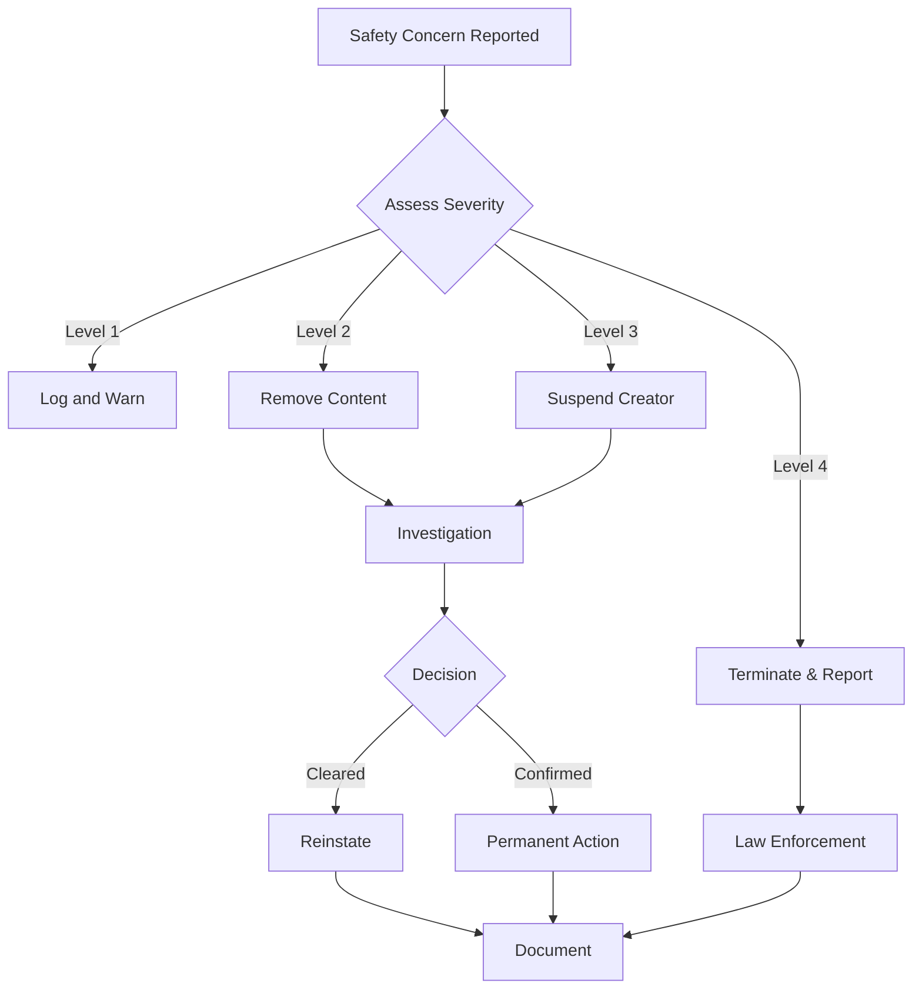

# Creator Platform Safety Guidelines & Compliance Requirements

## Executive Summary

The Creator Platform must maintain the highest standards of child safety while enabling creative freedom for content creators. This document outlines comprehensive safety measures, compliance requirements, and operational procedures to ensure COPPA compliance and child protection.

## Core Safety Principles

### 1. Zero Direct Contact
**Absolute Rule**: No creator shall ever have direct communication access to any child user.

- All content delivery is one-way through the platform
- No messaging, comments, or interaction features between creators and children
- Creator names shown to children are always pseudonyms
- Real creator information is never exposed to child accounts

### 2. Multi-Layer Content Screening
Every piece of content must pass through multiple safety checks before reaching children:

1. **Automated Pre-screening** (Immediate)
2. **AI Safety Analysis** (< 1 hour)
3. **Human Review** (< 24 hours)
4. **Parent Preview Option** (Always available)
5. **Community Reporting** (Post-publication)

### 3. Creator Vetting & Monitoring
Comprehensive background checks and continuous monitoring:

- Identity verification required for all creators
- Background checks for educator claims
- Continuous monitoring of creator behavior
- Immediate suspension upon safety concerns
- Lifetime bans for serious violations

## COPPA Compliance Requirements

### Data Protection
```
REQUIRED MEASURES:
✓ No collection of child PII by creators
✓ Analytics data fully anonymized
✓ Age data shown only in ranges (e.g., "3-5 years")
✓ Geographic data limited to country/state level
✓ No tracking pixels or third-party analytics in creator content
✓ All child interactions logged for audit purposes
```

### Parental Control
```
PARENT RIGHTS:
✓ Review all content before child access
✓ Block specific creators
✓ Report inappropriate content
✓ Access full content history
✓ Delete any purchased content
✓ Request refunds for safety concerns
```

### Age Verification
```
VERIFICATION LAYERS:
1. Parent account creation with credit card
2. Child profile creation with birthdate
3. Age-appropriate content filtering
4. Periodic re-verification
5. Account suspension if age discrepancies detected
```

## Content Safety Standards

### Prohibited Content Categories

#### Absolutely Forbidden
- Violence or aggression
- Weapons or dangerous items
- Sexual content or innuendo
- Substance use references
- Gambling or chance-based rewards
- Horror or frightening imagery
- Death or serious injury
- Discrimination or hate speech
- Political or religious indoctrination
- Personal information requests

#### Requires Special Handling
- Mild conflict resolution (must show positive outcomes)
- Fantasy violence (cartoon only, no realistic depictions)
- Competitive elements (must emphasize fun over winning)
- Food content (must align with nutrition guidelines)
- Animal content (must show proper care and respect)

### Required Content Elements

#### Educational Value
- Clear learning objectives
- Age-appropriate complexity
- Skill development focus
- Positive reinforcement only
- Growth mindset messaging

#### Safety Messaging
- Appropriate adult supervision references
- Internet safety reminders (when relevant)
- Stranger danger awareness (age-appropriate)
- Emotional safety and well-being
- Inclusive and respectful language

## Automated Safety Scanning

### Technical Implementation
```python
# Pseudo-code for safety pipeline
def content_safety_pipeline(content):
    # Stage 1: Text Analysis
    text_safety = analyze_text_safety(content.text)
    if text_safety.score < MINIMUM_THRESHOLD:
        return reject_with_reason(text_safety.issues)
    
    # Stage 2: Image Analysis
    image_safety = analyze_images(content.images)
    if image_safety.contains_prohibited:
        return reject_with_reason(image_safety.issues)
    
    # Stage 3: Audio Analysis
    audio_safety = analyze_audio(content.audio)
    if audio_safety.inappropriate:
        return reject_with_reason(audio_safety.issues)
    
    # Stage 4: Interaction Safety
    interaction_safety = analyze_interactions(content.interactive_elements)
    if interaction_safety.risks_detected:
        return flag_for_human_review(interaction_safety.concerns)
    
    # Stage 5: Educational Value
    educational_score = assess_educational_value(content)
    if educational_score < MINIMUM_EDUCATIONAL_VALUE:
        return request_improvements(educational_score.suggestions)
    
    return approve_for_human_review()
```

### AI Safety Services Integration

#### OpenAI Moderation API
- Text content screening
- Hate speech detection
- Violence detection
- Sexual content detection
- Self-harm detection

#### Google Cloud Vision API
- Image content moderation
- Face detection (for privacy)
- Text in image extraction
- Explicit content detection

#### Amazon Rekognition
- Video content analysis
- Celebrity detection (copyright)
- Inappropriate content detection
- Text detection in videos

#### Custom WonderNest Models
- Educational value scoring
- Age appropriateness classification
- Vocabulary complexity analysis
- Interaction safety assessment

## Human Moderation Workflow

### Moderation Tiers

#### Tier 1: Initial Review (Contractors)
- Basic safety check
- Guideline compliance
- Obvious issue flagging
- 15-minute time limit per item

#### Tier 2: Quality Review (Staff)
- Educational value assessment
- Age appropriateness verification
- Detailed feedback provision
- 30-minute time limit per item

#### Tier 3: Senior Review (Specialists)
- Edge case evaluation
- Policy interpretation
- Creator coaching
- No time limit

#### Tier 4: Executive Review (Management)
- Policy exceptions
- High-risk content
- VIP creator content
- Legal consultation

### Moderation Checklist

```markdown
## Safety Review Checklist

### Content Appropriateness
- [ ] No violence or aggression
- [ ] No scary or disturbing imagery
- [ ] No inappropriate language
- [ ] No dangerous behaviors shown
- [ ] No personal information requests

### Educational Value
- [ ] Clear learning objectives stated
- [ ] Age-appropriate concepts
- [ ] Accurate information
- [ ] Positive messaging
- [ ] Skill development focus

### Technical Quality
- [ ] Clear audio/visuals
- [ ] Proper pacing for age group
- [ ] Interactive elements function correctly
- [ ] No broken links or references
- [ ] Accessibility features present

### Cultural Sensitivity
- [ ] Inclusive representation
- [ ] No stereotypes
- [ ] Respectful of all cultures
- [ ] Appropriate for global audience
- [ ] No political/religious bias

### Parent Perspective
- [ ] Would I let my child use this?
- [ ] Clear value proposition for parents
- [ ] Transparent about content nature
- [ ] Appropriate duration/complexity
- [ ] Supports parental involvement
```

## Creator Safety Requirements

### Identity Verification Process

#### Step 1: Basic Identity
- Government-issued ID upload
- Selfie verification
- Address verification
- Phone number verification
- Email verification

#### Step 2: Background Screening
- Criminal background check (7 years)
- Sex offender registry check
- Professional license verification
- Social media screening
- Reference checks (for educators)

#### Step 3: Ongoing Monitoring
- Annual re-verification
- Continuous registry monitoring
- Content pattern analysis
- Complaint tracking
- Behavioral analysis

### Creator Agreement Terms

```markdown
## Safety Commitments

As a WonderNest Creator, I agree to:

1. **Child Safety First**
   - Never attempt to contact children directly
   - Never request personal information
   - Never include inappropriate content
   - Always consider child well-being

2. **Content Standards**
   - Follow all WonderNest guidelines
   - Ensure educational value
   - Maintain age appropriateness
   - Accept moderation decisions

3. **Professional Conduct**
   - Maintain professional boundaries
   - Respond professionally to feedback
   - Report safety concerns immediately
   - Cooperate with investigations

4. **Legal Compliance**
   - Comply with COPPA regulations
   - Respect intellectual property
   - Maintain required documentation
   - Accept liability for content

5. **Platform Cooperation**
   - Provide accurate information
   - Update credentials as needed
   - Participate in training
   - Support safety initiatives
```

## Incident Response Procedures

### Severity Levels

#### Level 1: Minor Guideline Violation
- **Response Time**: 24 hours
- **Action**: Warning and education
- **Documentation**: Internal log only
- **Notification**: Creator only

#### Level 2: Significant Safety Concern
- **Response Time**: 4 hours
- **Action**: Content removal and review
- **Documentation**: Detailed report
- **Notification**: Creator and management

#### Level 3: Serious Safety Violation
- **Response Time**: 1 hour
- **Action**: Immediate suspension
- **Documentation**: Full investigation
- **Notification**: Legal and executives

#### Level 4: Criminal Activity
- **Response Time**: Immediate
- **Action**: Account termination
- **Documentation**: Law enforcement report
- **Notification**: Authorities and legal

### Response Workflow



## Technology Safeguards

### Account Isolation
```yaml
creator_account:
  isolated_from:
    - child_profiles
    - child_data
    - parent_personal_info
  access_to:
    - anonymized_analytics
    - aggregate_metrics
    - content_management
    - payment_info_own
```

### Data Encryption
```yaml
encryption_requirements:
  at_rest:
    - AES-256 for all PII
    - Separate keys per data type
    - Key rotation every 90 days
  in_transit:
    - TLS 1.3 minimum
    - Certificate pinning
    - Perfect forward secrecy
  application_layer:
    - Field-level encryption for sensitive data
    - Tokenization for payment info
    - Hashing for verification data
```

### Audit Logging
```yaml
logged_events:
  - creator_login_attempts
  - content_submissions
  - moderation_decisions
  - data_access_attempts
  - configuration_changes
  - payment_transactions
  - support_interactions
  - policy_violations

retention:
  standard_logs: 1_year
  security_logs: 3_years
  legal_holds: indefinite
```

## Compliance Monitoring

### Key Performance Indicators

#### Safety Metrics
- **Target**: < 0.01% inappropriate content reaching children
- **Measurement**: Parent reports / Total content views
- **Review**: Weekly

#### Moderation Efficiency
- **Target**: < 24 hours average review time
- **Measurement**: Submission to decision time
- **Review**: Daily

#### Creator Compliance
- **Target**: > 95% first-time approval rate
- **Measurement**: Approved / Total submissions
- **Review**: Monthly

#### Incident Response
- **Target**: < 1 hour for Level 3+ incidents
- **Measurement**: Report to action time
- **Review**: Per incident

### Regular Audits

#### Monthly
- Moderation accuracy sampling (100 random reviews)
- Creator verification status check
- Automated safety system performance
- Parent complaint analysis

#### Quarterly
- Full creator portfolio review
- Policy compliance assessment
- Third-party security audit
- Legal compliance review

#### Annually
- Comprehensive safety audit
- COPPA compliance certification
- Creator re-verification campaign
- Policy and procedure update

## Training Requirements

### Creator Onboarding Training

#### Module 1: Child Safety Fundamentals (Required)
- Understanding child development
- Age-appropriate content creation
- COPPA requirements
- WonderNest safety standards

#### Module 2: Content Guidelines (Required)
- Prohibited content categories
- Educational value requirements
- Cultural sensitivity
- Quality standards

#### Module 3: Platform Tools (Required)
- Content creation interface
- Asset management
- Analytics interpretation
- Support resources

#### Module 4: Best Practices (Recommended)
- Successful content strategies
- Engagement techniques
- Educational methodology
- Community building

### Moderator Training

#### Initial Certification (40 hours)
- Child safety principles
- COPPA regulations
- Content guidelines
- Moderation tools
- Edge case scenarios
- Escalation procedures

#### Ongoing Training (4 hours/month)
- Policy updates
- New threat patterns
- Tool improvements
- Case study reviews
- Refresher modules

## Legal Compliance Framework

### Required Documentation
- Creator agreements signed and stored
- Identity verification records
- Background check results
- Tax documentation (W9/W8)
- Content licenses
- Moderation decisions
- Incident reports
- Audit trails

### Regulatory Compliance
- **COPPA** (US): Full compliance required
- **GDPR** (EU): Data protection for EU creators
- **CCPA** (California): Privacy rights compliance
- **PIPEDA** (Canada): Personal information protection
- **State Laws**: Various state-specific requirements

### Insurance Requirements
- General liability: $5M minimum
- Professional liability: $3M minimum
- Cyber liability: $10M minimum
- Media liability: $5M minimum
- Employment practices: $2M minimum

## Emergency Procedures

### Content Takedown Process
1. **Immediate Removal** (< 5 minutes)
   - Automated flagging system trigger
   - Manual emergency button
   - Executive override

2. **Investigation** (< 4 hours)
   - Content preservation for evidence
   - Creator notification
   - Detailed review

3. **Resolution** (< 24 hours)
   - Final decision
   - Appeals process if applicable
   - Documentation

### Creator Suspension Protocol
1. **Immediate Actions**
   - Account access revoked
   - Content hidden from marketplace
   - Payments frozen

2. **Investigation Phase**
   - Evidence collection
   - Creator statement opportunity
   - Legal consultation if needed

3. **Final Decision**
   - Reinstatement with conditions
   - Permanent termination
   - Law enforcement referral

## Continuous Improvement

### Feedback Loops
- Parent reports analysis
- Creator feedback integration
- Moderator suggestions
- Automated system improvements
- Industry best practices adoption

### Innovation Priorities
- Advanced AI safety detection
- Real-time content analysis
- Predictive risk modeling
- Automated educational scoring
- Enhanced parent controls

### Success Metrics
- Zero serious safety incidents
- 99.99% appropriate content rate
- < 24 hour moderation time
- > 95% creator satisfaction
- 100% COPPA compliance

## Conclusion

The Creator Platform's safety framework represents a comprehensive approach to child protection while enabling creative content development. Through multiple layers of technological, human, and procedural safeguards, we ensure that WonderNest remains the safest platform for children's educational content while supporting a thriving creator ecosystem.

Regular review and updates of these guidelines ensure continuous improvement and adaptation to emerging threats and opportunities in the children's digital content space.