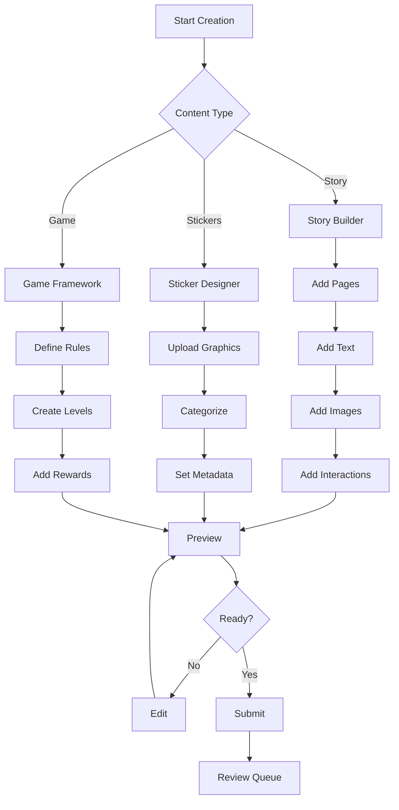
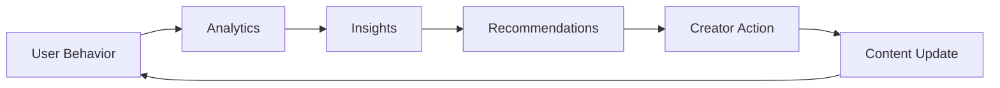

# Content Creator Flow - Admin Portal

## Executive Summary
An admin-first content management system that prioritizes immediate marketplace seeding by the WonderNest team, with a phased approach to creator onboarding. This system enables rapid content population while maintaining quality standards and COPPA compliance.

## Product Vision
Phase 1: Enable WonderNest admins to quickly seed the marketplace with high-quality content
Phase 2: Gradually open to invited creators with simplified onboarding
Phase 3: Build a sustainable creator economy ecosystem
Phase 4: Enable parent contributions through integrated apps

## Implementation Priority
**CRITICAL**: Start with Admin Seeding MVP (2 weeks) - See `admin_seeding_mvp.md` for immediate implementation plan.

## Strategic Context

### Business Objectives
1. **Revenue Diversification**: Create multiple revenue streams through content sales commissions
2. **Content Scale**: Enable rapid content library growth without internal production costs
3. **Quality Control**: Maintain high standards through moderation and curation
4. **Creator Retention**: Build loyal creator community through fair revenue sharing
5. **Market Position**: Establish WonderNest as the premier platform for children's educational content

### User Segments (By Priority)

#### Phase 1: Internal Team (Weeks 1-2)
- **WonderNest Admins**: Seed marketplace with initial content
- **Staff Content Team**: Create and curate foundational content
- **QA Team**: Test and validate content delivery

#### Phase 2: Invited Creators (Weeks 3-4)
- **Verified Partners**: Hand-picked content creators
- **Professional Educators**: Teachers with existing content
- **Trusted Artists**: Pre-approved illustrators and designers

#### Phase 3: Open Creators (Weeks 5-6)
- **Digital Artists**: Illustrators creating sticker packs
- **Story Authors**: Writers creating interactive stories
- **Game Developers**: Educational mini-game creators

#### Phase 4: Parent Contributors (Weeks 7-8)
- **Active Parents**: Contributing through story book app
- **Community Creators**: User-generated content with moderation

## Core User Flows

### 1. Creator Onboarding Flow

#### Entry Points
- Marketing website CTA
- Admin portal invitation
- Partner referral programs
- Social media campaigns

#### Onboarding Steps
```
1. Application Submission
   ├── Basic Information (name, email, expertise)
   ├── Content Portfolio (3-5 samples)
   ├── Educational Background (optional)
   └── Target Age Groups

2. Identity Verification
   ├── Email Verification
   ├── Phone Verification (SMS)
   ├── Tax Documentation (W-9/W-8)
   └── Background Check Consent

3. Creator Profile Setup
   ├── Display Name & Bio
   ├── Avatar & Cover Image
   ├── Content Specialties
   ├── Social Links
   └── Payment Setup (Stripe Connect)

4. Training & Guidelines
   ├── Content Guidelines Review
   ├── COPPA Compliance Training
   ├── Platform Tools Tutorial
   └── Quality Standards Certification

5. Account Activation
   ├── Tier Assignment (Hobbyist Start)
   ├── Dashboard Access
   ├── First Content Upload
   └── Welcome Package
```

### 2. Content Creation Flow

#### Content Types & Templates

##### Story Packs
```yaml
Structure:
  - Title & Description
  - Age Range (2-4, 4-6, 6-8)
  - Educational Goals
  - Page Count (10-50 pages)
  - Interactive Elements
  - Audio Narration (optional)
  - Vocabulary Words
  
Pricing Model:
  - Base: $2.99 - $9.99
  - Premium (with audio): +$2.00
  - Bundle Discount: 20-30%
```

##### Sticker Packs
```yaml
Structure:
  - Pack Name & Theme
  - Sticker Count (20-100)
  - Categories/Tags
  - Vector Graphics (SVG)
  - Animations (optional)
  
Pricing Model:
  - Basic Pack (20-30): $0.99
  - Standard Pack (50): $1.99
  - Mega Pack (100+): $3.99
```

##### Educational Games
```yaml
Structure:
  - Game Title & Type
  - Learning Objectives
  - Difficulty Levels
  - Progress Tracking
  - Reward System
  
Pricing Model:
  - Single Game: $4.99
  - Game Bundle: $9.99
  - Subscription Access: Included
```

#### Creation Workflow



### 3. Content Review & Moderation Flow

#### Automated Review (Phase 1)
```python
def automated_review(content):
    checks = {
        'inappropriate_content': scan_for_inappropriate(),
        'copyright_violation': check_copyright(),
        'quality_threshold': assess_quality(),
        'age_appropriateness': verify_age_rating(),
        'technical_validation': validate_format()
    }
    
    if all(checks.values()):
        return 'APPROVED_FOR_MANUAL'
    else:
        return 'FLAGGED', failed_checks
```

#### Manual Review (Phase 2)
```yaml
Review Checklist:
  Educational Value:
    - Clear learning objectives
    - Age-appropriate complexity
    - Accurate information
    
  Safety & Compliance:
    - COPPA compliant
    - No personal data collection
    - Safe external links
    
  Quality Standards:
    - Professional presentation
    - Proper grammar/spelling
    - Functional interactions
    
  Cultural Sensitivity:
    - Inclusive representation
    - No stereotypes
    - Respectful content
```

#### Review Outcomes
1. **Approved**: Content goes live immediately
2. **Conditional Approval**: Minor fixes required
3. **Major Revision**: Significant changes needed
4. **Rejected**: Policy violation or quality issues

### 4. Publishing & Distribution Flow

#### Publishing Options

##### Immediate Release
- Content goes live upon approval
- Appears in "New Releases" section
- Creator notified of launch

##### Scheduled Release
- Set future publication date
- Build anticipation with "Coming Soon"
- Coordinate with marketing campaigns

##### Soft Launch
- Limited visibility (10% of users)
- Gather initial feedback
- Iterate before full release

#### Pricing & Monetization

##### Revenue Share Model
```
Creator Tiers:
┌─────────────┬──────────────┬─────────────┬──────────────┐
│    Tier     │ Monthly Sales│ Rev Share % │ Other Perks  │
├─────────────┼──────────────┼─────────────┼──────────────┤
│ Hobbyist    │ 0-10         │ 65%         │ Basic tools  │
│ Emerging    │ 11-50        │ 70%         │ Analytics    │
│ Professional│ 51-500       │ 75%         │ Featured     │
│ Partner     │ 500+         │ 80%         │ Co-marketing │
└─────────────┴──────────────┴─────────────┴──────────────┘
```

##### Promotional Tools
- **Discount Codes**: Creator-specific codes
- **Limited-Time Offers**: Flash sales
- **Bundle Creation**: Package multiple items
- **Referral Program**: Earn from referrals

### 5. Analytics & Optimization Flow

#### Creator Dashboard Metrics

##### Real-Time Analytics
```yaml
Sales Performance:
  - Units Sold Today
  - Revenue Today
  - Conversion Rate
  - Cart Abandonment
  
Engagement Metrics:
  - View Count
  - Preview Rate
  - Completion Rate
  - User Ratings
  
Audience Insights:
  - Age Distribution
  - Geographic Spread
  - Device Types
  - Peak Usage Times
```

##### Performance Reports
```yaml
Weekly Report:
  - Sales Summary
  - Top Performing Content
  - User Feedback
  - Optimization Suggestions
  
Monthly Report:
  - Revenue Trends
  - Growth Metrics
  - Competitive Analysis
  - Tier Progress
```

#### Content Optimization Tools

##### A/B Testing
- Test different thumbnails
- Vary pricing strategies
- Compare descriptions
- Measure conversion impact

##### Feedback Loop


## Technical Architecture

### System Components

#### Content Management System (CMS)
```yaml
Features:
  - WYSIWYG Editor for stories
  - Vector graphics uploader
  - Media library management
  - Version control
  - Collaborative editing
  
Tech Stack:
  - Frontend: React with TipTap editor
  - Storage: S3 with CloudFront CDN
  - Database: PostgreSQL with JSONB
```

#### Review Pipeline
```yaml
Components:
  - Automated scanners (AI-powered)
  - Review queue management
  - Moderation dashboard
  - Feedback system
  - Appeals process
  
Integration:
  - OpenAI for content analysis
  - Custom ML models for age rating
  - Human-in-the-loop workflow
```

#### Distribution System
```yaml
Infrastructure:
  - Global CDN (CloudFront)
  - Multi-region storage
  - Offline sync capability
  - Progressive download
  - DRM for premium content
```

### API Design

#### Creator Management Endpoints
```typescript
// Creator Profile
POST   /api/admin/creators/onboard
GET    /api/admin/creators/profile
PUT    /api/admin/creators/profile
GET    /api/admin/creators/metrics

// Content Management
POST   /api/admin/content/create
PUT    /api/admin/content/{id}
DELETE /api/admin/content/{id}
POST   /api/admin/content/{id}/publish
GET    /api/admin/content/drafts

// Review System
GET    /api/admin/review/queue
POST   /api/admin/review/{id}/approve
POST   /api/admin/review/{id}/reject
POST   /api/admin/review/{id}/request-changes

// Analytics
GET    /api/admin/analytics/dashboard
GET    /api/admin/analytics/content/{id}
GET    /api/admin/analytics/revenue
POST   /api/admin/analytics/export
```

### Database Schema Extensions

```sql
-- Content drafts and versions
CREATE TABLE content.creator_drafts (
    id UUID PRIMARY KEY DEFAULT gen_random_uuid(),
    creator_id UUID NOT NULL REFERENCES games.creator_profiles(id),
    content_type VARCHAR(50) NOT NULL,
    
    -- Draft content
    title VARCHAR(255) NOT NULL,
    description TEXT,
    content_data JSONB NOT NULL,
    
    -- Metadata
    age_range INT4RANGE,
    educational_goals TEXT[],
    tags TEXT[],
    
    -- Status tracking
    status VARCHAR(30) DEFAULT 'draft',
    review_status VARCHAR(30),
    review_feedback JSONB,
    
    -- Versioning
    version INTEGER DEFAULT 1,
    parent_version_id UUID,
    
    -- Publishing
    scheduled_publish_at TIMESTAMP WITH TIME ZONE,
    published_content_id UUID,
    
    created_at TIMESTAMP WITH TIME ZONE DEFAULT CURRENT_TIMESTAMP,
    updated_at TIMESTAMP WITH TIME ZONE DEFAULT CURRENT_TIMESTAMP,
    
    INDEX idx_creator_drafts_creator (creator_id),
    INDEX idx_creator_drafts_status (status)
);

-- Review queue and history
CREATE TABLE content.review_queue (
    id UUID PRIMARY KEY DEFAULT gen_random_uuid(),
    draft_id UUID NOT NULL REFERENCES content.creator_drafts(id),
    
    -- Review assignment
    assigned_to UUID,
    assigned_at TIMESTAMP WITH TIME ZONE,
    
    -- Review process
    priority INTEGER DEFAULT 5,
    automated_score DECIMAL(3,2),
    automated_flags JSONB,
    
    -- Review outcome
    review_status VARCHAR(30) NOT NULL DEFAULT 'pending',
    reviewed_by UUID,
    reviewed_at TIMESTAMP WITH TIME ZONE,
    review_notes TEXT,
    
    -- Escalation
    escalated BOOLEAN DEFAULT false,
    escalation_reason TEXT,
    
    created_at TIMESTAMP WITH TIME ZONE DEFAULT CURRENT_TIMESTAMP,
    updated_at TIMESTAMP WITH TIME ZONE DEFAULT CURRENT_TIMESTAMP,
    
    INDEX idx_review_queue_status (review_status),
    INDEX idx_review_queue_priority (priority DESC)
);

-- Creator analytics and metrics
CREATE TABLE analytics.creator_metrics (
    id UUID PRIMARY KEY DEFAULT gen_random_uuid(),
    creator_id UUID NOT NULL REFERENCES games.creator_profiles(id),
    metric_date DATE NOT NULL,
    
    -- Sales metrics
    units_sold INTEGER DEFAULT 0,
    revenue DECIMAL(10,2) DEFAULT 0,
    refunds INTEGER DEFAULT 0,
    refund_amount DECIMAL(10,2) DEFAULT 0,
    
    -- Engagement metrics
    content_views INTEGER DEFAULT 0,
    preview_views INTEGER DEFAULT 0,
    add_to_cart INTEGER DEFAULT 0,
    conversion_rate DECIMAL(5,2),
    
    -- User metrics
    unique_buyers INTEGER DEFAULT 0,
    repeat_buyers INTEGER DEFAULT 0,
    average_rating DECIMAL(3,2),
    review_count INTEGER DEFAULT 0,
    
    created_at TIMESTAMP WITH TIME ZONE DEFAULT CURRENT_TIMESTAMP,
    
    UNIQUE(creator_id, metric_date),
    INDEX idx_creator_metrics_date (metric_date)
);
```

## Implementation Roadmap (Revised Admin-First)

### Phase 1: Admin Seeding MVP (Weeks 1-2) 🚀
**Focus**: Enable immediate marketplace population by WonderNest team
**See**: `admin_seeding_mvp.md` for detailed 14-day sprint plan

#### Week 1 - Admin Tools Foundation
- [ ] Simplified database for admin creators
- [ ] Quick content upload endpoints
- [ ] Basic admin UI for content management
- [ ] Direct S3 file upload
- [ ] Bulk import capability

#### Week 2 - Publishing & Polish
- [ ] Direct marketplace publishing
- [ ] Bulk operations interface
- [ ] Basic analytics dashboard
- [ ] CDN integration
- [ ] Production deployment

### Phase 2: Invited Creators (Weeks 3-4)
**Focus**: Onboard hand-picked creators with minimal friction

#### Week 3
- [ ] Story builder interface
- [ ] Sticker pack uploader
- [ ] Content preview system
- [ ] Version control
- [ ] Auto-save functionality

#### Week 4
- [ ] Rich text editor integration
- [ ] Media library management
- [ ] Template system
- [ ] Metadata management
- [ ] Educational goal tracking

### Phase 3: Creator Self-Service (Weeks 5-6)
**Focus**: Open registration with basic onboarding and review

#### Week 5
- [ ] Automated content scanning
- [ ] Review dashboard
- [ ] Moderation tools
- [ ] Feedback system
- [ ] Appeals process

#### Week 6
- [ ] Review metrics tracking
- [ ] Batch review tools
- [ ] Content flagging system
- [ ] Escalation workflow
- [ ] Quality scoring

### Phase 4: Parent Contributions (Weeks 7-8)
**Focus**: Enable content creation through integrated apps

#### Week 7
- [ ] Publishing workflow
- [ ] Marketplace integration
- [ ] Pricing tools
- [ ] Scheduling system
- [ ] Soft launch capability

#### Week 8
- [ ] CDN integration
- [ ] Content delivery optimization
- [ ] Download management
- [ ] DRM implementation
- [ ] Cache strategies

### Phase 5: Full Creator Platform (Weeks 9-12)
**Focus**: Complete creator ecosystem with analytics, payments, and support

#### Week 9
- [ ] Analytics dashboard
- [ ] Real-time metrics
- [ ] Revenue tracking
- [ ] Engagement metrics
- [ ] Report generation

#### Week 10
- [ ] A/B testing framework
- [ ] Performance insights
- [ ] Optimization recommendations
- [ ] Export capabilities
- [ ] Predictive analytics

### Phase 6: Scale & Polish (Weeks 11-12)
**Focus**: Performance, polish, and launch preparation

#### Week 11
- [ ] Performance optimization
- [ ] Load testing
- [ ] Security audit
- [ ] Documentation
- [ ] Creator resources

#### Week 12
- [ ] Beta testing with creators
- [ ] Bug fixes and refinements
- [ ] Launch preparation
- [ ] Marketing materials
- [ ] Support documentation

## Success Metrics

### Launch Metrics (Month 1)
- **Creators Onboarded**: 50+
- **Content Items Created**: 200+
- **Review Turnaround**: <24 hours
- **Creator Satisfaction**: >4.0/5
- **System Uptime**: 99.9%

### Growth Metrics (Month 3)
- **Active Creators**: 200+
- **Published Content**: 1,000+
- **Monthly GMV**: $50,000+
- **Average Creator Revenue**: $250/month
- **Content Quality Score**: >4.2/5

### Scale Metrics (Month 6)
- **Creator Community**: 500+
- **Content Library**: 5,000+ items
- **Monthly GMV**: $250,000+
- **Top Creator Revenue**: $5,000/month
- **International Creators**: 20%

## Risk Mitigation

### Content Quality Risks
- **Mitigation**: Strict review process, automated scanning, community reporting
- **Contingency**: Rapid content removal, creator suspension, quality incentives

### Creator Retention Risks
- **Mitigation**: Fair revenue share, growth tools, community building
- **Contingency**: Retention bonuses, exclusive partnerships, improved tools

### Technical Scalability Risks
- **Mitigation**: Cloud infrastructure, CDN, microservices architecture
- **Contingency**: Auto-scaling, regional distribution, performance monitoring

### Legal/Compliance Risks
- **Mitigation**: COPPA training, automated compliance checks, legal review
- **Contingency**: Content insurance, rapid response team, compliance audits

## Competitive Advantages

### vs. Traditional Marketplaces
1. **Specialized for Children**: COPPA compliant by design
2. **Educational Focus**: Learning objectives and outcomes
3. **Parent Control**: Visibility and approval mechanisms
4. **Quality Curation**: Human review and educational standards

### vs. Creator Platforms
1. **Higher Revenue Share**: 65-80% vs industry 50-70%
2. **Built-in Audience**: Direct access to engaged families
3. **Educational Tools**: Templates and frameworks for learning
4. **Growth Support**: Analytics, optimization, and marketing

### Unique Value Propositions
1. **Safety First**: Every piece of content reviewed
2. **Educational Impact**: Measurable learning outcomes
3. **Creator Success**: Tools and support for growth
4. **Family Trust**: Parent-approved content only

## Next Steps

### Immediate Actions (This Week)
1. Review and approve implementation plan
2. Allocate development resources
3. Set up infrastructure components
4. Begin database schema implementation
5. Create initial API endpoints

### Short-term Goals (Month 1)
1. Complete Phase 1 & 2 implementation
2. Onboard 10 alpha creators
3. Create 50 test content items
4. Establish review processes
5. Launch internal beta

### Long-term Vision (Year 1)
1. Build thriving creator ecosystem
2. Establish content quality standards
3. Create sustainable revenue model
4. Scale to international markets
5. Become category leader

## Conclusion

The Content Creator Flow represents a critical evolution in WonderNest's business model, transforming it from a platform into an ecosystem. By empowering creators while maintaining strict quality and safety standards, we create a sustainable competitive advantage that benefits all stakeholders: creators earn fair revenue, parents trust the content, children receive high-quality educational materials, and WonderNest builds a scalable business model.

The phased implementation approach ensures we can validate assumptions, iterate on feedback, and scale deliberately while maintaining the quality and safety that defines our brand. With projected GMV of $250,000/month within 6 months and a thriving community of 500+ creators, this initiative positions WonderNest as the definitive platform for children's educational content creation and distribution.