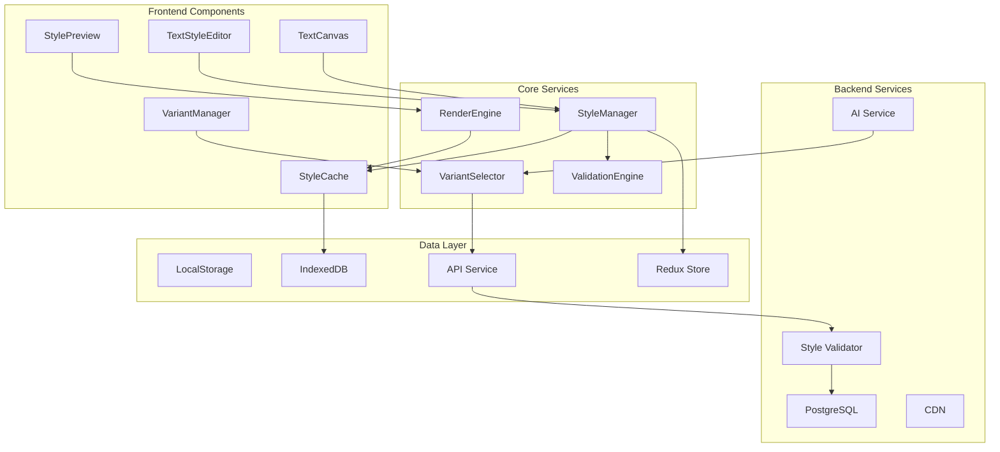

# Technical Architecture: Text Input Enhancements

## System Architecture Overview



## Data Models

### Enhanced TextBlock Interface

```typescript
// Updated TextBlock interface with styling support
export interface TextBlock {
  id: string
  position: { x: number; y: number }
  size?: { width: number; height: number }
  variants: TextVariant[]
  activeVariantId?: string
  style?: TextBlockStyle
  metadata: TextBlockMetadata
  vocabularyWords: string[]
  interactions?: TextInteraction[]
}

// New TextVariant interface replacing simple string variants
export interface TextVariant {
  id: string
  content: string
  metadata: VariantMetadata
  createdAt: string
  updatedAt: string
  isDefault?: boolean
  tags?: string[]
}

export interface VariantMetadata {
  difficulty: 'easy' | 'medium' | 'hard' | 'advanced'
  ageRange: [number, number] // [min, max]
  vocabularyLevel: number // 1-10 scale
  readingTime: number // estimated seconds
  wordCount: number
  characterCount: number
  sentenceComplexity: number // Flesch-Kincaid score
  educationalTags?: string[]
  languageCode?: string // for multi-language support
}

export interface TextBlockStyle {
  background?: BackgroundStyle
  text?: TextStyle
  effects?: TextEffects
  animation?: TextAnimation
  responsive?: ResponsiveStyle
  presetId?: string
}

export interface BackgroundStyle {
  type: 'solid' | 'gradient' | 'image' | 'pattern'
  color?: string // hex, rgb, rgba
  opacity?: number // 0-1
  gradient?: GradientStyle
  image?: BackgroundImage
  padding?: BoxSpacing
  borderRadius?: BorderRadius
  blur?: number // 0-20px backdrop blur
  mixBlendMode?: string
}

export interface GradientStyle {
  type: 'linear' | 'radial' | 'conic'
  colors: GradientStop[]
  angle?: number // for linear gradients
  center?: { x: number; y: number } // for radial
}

export interface GradientStop {
  color: string
  position: number // 0-100%
  opacity?: number
}

export interface TextStyle {
  color?: string
  fontSize?: number | 'responsive'
  fontWeight?: number | string
  fontFamily?: string
  lineHeight?: number
  letterSpacing?: number
  textAlign?: 'left' | 'center' | 'right' | 'justify'
  textDecoration?: string
  textTransform?: 'none' | 'uppercase' | 'lowercase' | 'capitalize'
  wordSpacing?: number
}

export interface TextEffects {
  shadow?: ShadowEffect[]
  glow?: GlowEffect
  outline?: OutlineEffect
  stroke?: StrokeEffect
  filter?: string // CSS filter
}

export interface TextAnimation {
  type: 'none' | 'pulse' | 'glow' | 'shimmer' | 'bounce' | 'fade' | 'slide'
  duration?: number // milliseconds
  delay?: number
  iteration?: number | 'infinite'
  easing?: string
  customKeyframes?: AnimationKeyframe[]
}

export interface TextBlockMetadata {
  createdAt: string
  updatedAt: string
  createdBy: string
  lockedForEditing?: boolean
  aiGenerated?: boolean
  validationStatus?: 'valid' | 'warning' | 'error'
  validationMessages?: string[]
}
```

### Style Preset System

```typescript
export interface StylePreset {
  id: string
  name: string
  description?: string
  category: PresetCategory
  style: TextBlockStyle
  thumbnail?: string
  tags: string[]
  isCustom: boolean
  isGlobal: boolean
  createdAt: string
  updatedAt: string
  usageCount: number
}

export type PresetCategory = 
  | 'emphasis'
  | 'vocabulary'
  | 'dialogue'
  | 'narration'
  | 'title'
  | 'caption'
  | 'interactive'
  | 'seasonal'
  | 'custom'

export interface StyleLibrary {
  presets: StylePreset[]
  categories: PresetCategory[]
  recentlyUsed: string[] // preset IDs
  favorites: string[] // preset IDs
  custom: StylePreset[]
}
```

## Component Architecture

### TextStyleEditor Component

```typescript
interface TextStyleEditorProps {
  textBlock: TextBlock
  onStyleChange: (style: TextBlockStyle) => void
  onVariantChange: (variants: TextVariant[]) => void
  presets?: StylePreset[]
  allowCustomStyles?: boolean
  validationRules?: ValidationRule[]
}

const TextStyleEditor: React.FC<TextStyleEditorProps> = ({
  textBlock,
  onStyleChange,
  onVariantChange,
  presets = [],
  allowCustomStyles = true,
  validationRules = []
}) => {
  const [activeTab, setActiveTab] = useState<'style' | 'variants' | 'presets'>('style')
  const [currentStyle, setCurrentStyle] = useState(textBlock.style || {})
  const [variants, setVariants] = useState(textBlock.variants || [])
  const [previewMode, setPreviewMode] = useState<'desktop' | 'tablet' | 'mobile'>('desktop')
  
  // Component implementation...
}
```

### VariantManager Component

```typescript
interface VariantManagerProps {
  variants: TextVariant[]
  activeVariantId?: string
  onVariantsChange: (variants: TextVariant[]) => void
  onActiveVariantChange: (variantId: string) => void
  enableAISuggestions?: boolean
  validationRules?: VariantValidationRule[]
}

const VariantManager: React.FC<VariantManagerProps> = ({
  variants,
  activeVariantId,
  onVariantsChange,
  onActiveVariantChange,
  enableAISuggestions = false,
  validationRules = []
}) => {
  const [editingVariant, setEditingVariant] = useState<TextVariant | null>(null)
  const [showBulkOperations, setShowBulkOperations] = useState(false)
  const [selectedVariants, setSelectedVariants] = useState<string[]>([])
  
  // Component implementation...
}
```

## Service Layer Architecture

### StyleManager Service

```typescript
class StyleManager {
  private static instance: StyleManager
  private styleCache: Map<string, TextBlockStyle>
  private computedStyles: Map<string, CSSProperties>
  private validationEngine: ValidationEngine
  
  private constructor() {
    this.styleCache = new Map()
    this.computedStyles = new Map()
    this.validationEngine = new ValidationEngine()
  }
  
  public static getInstance(): StyleManager {
    if (!StyleManager.instance) {
      StyleManager.instance = new StyleManager()
    }
    return StyleManager.instance
  }
  
  public applyStyle(
    textBlock: TextBlock,
    style: TextBlockStyle
  ): { success: boolean; errors?: string[] } {
    // Validate style
    const validation = this.validationEngine.validateStyle(style)
    if (!validation.isValid) {
      return { success: false, errors: validation.errors }
    }
    
    // Compute CSS properties
    const cssProperties = this.computeCSS(style)
    
    // Cache computed style
    this.computedStyles.set(textBlock.id, cssProperties)
    
    // Apply to DOM element
    this.applyToDOM(textBlock.id, cssProperties)
    
    return { success: true }
  }
  
  private computeCSS(style: TextBlockStyle): CSSProperties {
    const css: CSSProperties = {}
    
    // Background styles
    if (style.background) {
      css.background = this.computeBackground(style.background)
      css.opacity = style.background.opacity
      css.padding = this.computePadding(style.background.padding)
      css.borderRadius = this.computeBorderRadius(style.background.borderRadius)
      
      if (style.background.blur) {
        css.backdropFilter = `blur(${style.background.blur}px)`
      }
    }
    
    // Text styles
    if (style.text) {
      Object.assign(css, style.text)
    }
    
    // Effects
    if (style.effects) {
      css.textShadow = this.computeTextShadow(style.effects.shadow)
      css.filter = this.computeFilter(style.effects)
    }
    
    // Animation
    if (style.animation && style.animation.type !== 'none') {
      css.animation = this.computeAnimation(style.animation)
    }
    
    return css
  }
  
  private computeBackground(bg: BackgroundStyle): string {
    switch (bg.type) {
      case 'solid':
        return bg.color || 'transparent'
      case 'gradient':
        return this.computeGradient(bg.gradient!)
      case 'image':
        return `url(${bg.image!.url})`
      case 'pattern':
        return this.computePattern(bg)
      default:
        return 'transparent'
    }
  }
  
  private computeGradient(gradient: GradientStyle): string {
    const stops = gradient.colors
      .map(stop => `${stop.color} ${stop.position}%`)
      .join(', ')
    
    switch (gradient.type) {
      case 'linear':
        return `linear-gradient(${gradient.angle || 0}deg, ${stops})`
      case 'radial':
        const center = gradient.center || { x: 50, y: 50 }
        return `radial-gradient(circle at ${center.x}% ${center.y}%, ${stops})`
      case 'conic':
        return `conic-gradient(from ${gradient.angle || 0}deg, ${stops})`
      default:
        return 'transparent'
    }
  }
}
```

### VariantSelector Service

```typescript
class VariantSelector {
  private selectionHistory: Map<string, string[]> // textBlockId -> variantIds
  private userPreferences: UserPreferences
  private aiService?: AIService
  
  constructor(userPreferences: UserPreferences, aiService?: AIService) {
    this.selectionHistory = new Map()
    this.userPreferences = userPreferences
    this.aiService = aiService
  }
  
  public async selectVariant(
    textBlock: TextBlock,
    context: SelectionContext
  ): Promise<TextVariant> {
    const { mode, childAge, readingLevel, previousSelections } = context
    
    switch (mode) {
      case 'manual':
        return this.selectManual(textBlock, context)
      
      case 'difficulty':
        return this.selectByDifficulty(textBlock, context)
      
      case 'age':
        return this.selectByAge(textBlock, childAge!)
      
      case 'ai':
        return this.selectWithAI(textBlock, context)
      
      case 'adaptive':
        return this.selectAdaptive(textBlock, context)
      
      default:
        return this.selectDefault(textBlock)
    }
  }
  
  private selectByDifficulty(
    textBlock: TextBlock,
    context: SelectionContext
  ): TextVariant {
    const targetDifficulty = context.readingLevel || 'medium'
    
    // Find exact match
    const exactMatch = textBlock.variants.find(
      v => v.metadata.difficulty === targetDifficulty
    )
    if (exactMatch) return exactMatch
    
    // Find closest match
    const difficultyOrder = ['easy', 'medium', 'hard', 'advanced']
    const targetIndex = difficultyOrder.indexOf(targetDifficulty)
    
    // Search for nearest difficulty
    for (let distance = 1; distance < difficultyOrder.length; distance++) {
      const lowerIndex = targetIndex - distance
      const upperIndex = targetIndex + distance
      
      if (lowerIndex >= 0) {
        const lowerMatch = textBlock.variants.find(
          v => v.metadata.difficulty === difficultyOrder[lowerIndex]
        )
        if (lowerMatch) return lowerMatch
      }
      
      if (upperIndex < difficultyOrder.length) {
        const upperMatch = textBlock.variants.find(
          v => v.metadata.difficulty === difficultyOrder[upperIndex]
        )
        if (upperMatch) return upperMatch
      }
    }
    
    return this.selectDefault(textBlock)
  }
  
  private selectByAge(textBlock: TextBlock, childAge: number): TextVariant {
    // Find variants that include the child's age in their range
    const ageMatches = textBlock.variants.filter(v => {
      const [min, max] = v.metadata.ageRange
      return childAge >= min && childAge <= max
    })
    
    if (ageMatches.length === 0) {
      // No exact matches, find closest
      const sorted = [...textBlock.variants].sort((a, b) => {
        const aDist = Math.min(
          Math.abs(childAge - a.metadata.ageRange[0]),
          Math.abs(childAge - a.metadata.ageRange[1])
        )
        const bDist = Math.min(
          Math.abs(childAge - b.metadata.ageRange[0]),
          Math.abs(childAge - b.metadata.ageRange[1])
        )
        return aDist - bDist
      })
      return sorted[0]
    }
    
    // Among age matches, select based on vocabulary level
    const sorted = ageMatches.sort((a, b) => {
      const aScore = this.scoreVariantForAge(a, childAge)
      const bScore = this.scoreVariantForAge(b, childAge)
      return bScore - aScore
    })
    
    return sorted[0]
  }
  
  private scoreVariantForAge(variant: TextVariant, age: number): number {
    const [min, max] = variant.metadata.ageRange
    const range = max - min
    const position = (age - min) / range // 0 to 1, where 0.5 is middle
    
    // Prefer variants where age is in the middle of the range
    const positionScore = 1 - Math.abs(position - 0.5) * 2
    
    // Consider vocabulary level (assumed 1-10 scale)
    const expectedVocabLevel = Math.min(10, Math.max(1, age - 2))
    const vocabScore = 1 - Math.abs(variant.metadata.vocabularyLevel - expectedVocabLevel) / 10
    
    return positionScore * 0.6 + vocabScore * 0.4
  }
  
  private async selectWithAI(
    textBlock: TextBlock,
    context: SelectionContext
  ): Promise<TextVariant> {
    if (!this.aiService) {
      return this.selectAdaptive(textBlock, context)
    }
    
    try {
      const recommendation = await this.aiService.recommendVariant({
        variants: textBlock.variants,
        context,
        history: this.selectionHistory.get(textBlock.id) || []
      })
      
      const variant = textBlock.variants.find(v => v.id === recommendation.variantId)
      if (variant) {
        this.recordSelection(textBlock.id, variant.id)
        return variant
      }
    } catch (error) {
      console.error('AI selection failed, falling back to adaptive', error)
    }
    
    return this.selectAdaptive(textBlock, context)
  }
  
  private recordSelection(textBlockId: string, variantId: string): void {
    const history = this.selectionHistory.get(textBlockId) || []
    history.push(variantId)
    
    // Keep only last 10 selections
    if (history.length > 10) {
      history.shift()
    }
    
    this.selectionHistory.set(textBlockId, history)
  }
}

interface SelectionContext {
  mode: 'manual' | 'difficulty' | 'age' | 'ai' | 'adaptive'
  childAge?: number
  readingLevel?: 'easy' | 'medium' | 'hard' | 'advanced'
  previousSelections?: string[]
  storyProgress?: number // 0-1
  sessionDuration?: number // minutes
  engagementScore?: number // 0-1
}
```

## Rendering Pipeline

### Optimized Render Flow

```typescript
class TextBlockRenderer {
  private renderQueue: RenderTask[]
  private rafId: number | null = null
  private styleCache: Map<string, ComputedStyle>
  private intersectionObserver: IntersectionObserver
  
  constructor() {
    this.renderQueue = []
    this.styleCache = new Map()
    this.setupIntersectionObserver()
  }
  
  private setupIntersectionObserver(): void {
    this.intersectionObserver = new IntersectionObserver(
      (entries) => {
        entries.forEach(entry => {
          const textBlockId = entry.target.getAttribute('data-text-block-id')
          if (!textBlockId) return
          
          if (entry.isIntersecting) {
            this.queueRender(textBlockId, 'high')
          } else {
            this.dequeueRender(textBlockId)
          }
        })
      },
      {
        rootMargin: '100px',
        threshold: 0.1
      }
    )
  }
  
  public queueRender(
    textBlockId: string,
    priority: 'high' | 'normal' | 'low' = 'normal'
  ): void {
    const task: RenderTask = {
      id: textBlockId,
      priority,
      timestamp: Date.now()
    }
    
    // Remove existing task if present
    this.renderQueue = this.renderQueue.filter(t => t.id !== textBlockId)
    
    // Add based on priority
    if (priority === 'high') {
      this.renderQueue.unshift(task)
    } else if (priority === 'low') {
      this.renderQueue.push(task)
    } else {
      // Insert after high priority tasks
      const highPriorityCount = this.renderQueue.filter(t => t.priority === 'high').length
      this.renderQueue.splice(highPriorityCount, 0, task)
    }
    
    this.scheduleRender()
  }
  
  private scheduleRender(): void {
    if (this.rafId !== null) return
    
    this.rafId = requestAnimationFrame(() => {
      this.processRenderQueue()
      this.rafId = null
    })
  }
  
  private processRenderQueue(): void {
    const startTime = performance.now()
    const frameDeadline = startTime + 16 // Target 60fps
    
    while (this.renderQueue.length > 0 && performance.now() < frameDeadline) {
      const task = this.renderQueue.shift()
      if (task) {
        this.renderTextBlock(task.id)
      }
    }
    
    // If queue still has items, schedule next frame
    if (this.renderQueue.length > 0) {
      this.scheduleRender()
    }
  }
  
  private renderTextBlock(textBlockId: string): void {
    const element = document.querySelector(`[data-text-block-id="${textBlockId}"]`)
    if (!element) return
    
    const textBlock = this.getTextBlock(textBlockId)
    if (!textBlock) return
    
    // Check cache
    const cacheKey = this.computeCacheKey(textBlock)
    let computedStyle = this.styleCache.get(cacheKey)
    
    if (!computedStyle) {
      computedStyle = this.computeStyle(textBlock)
      this.styleCache.set(cacheKey, computedStyle)
    }
    
    // Apply styles
    this.applyStylesToElement(element as HTMLElement, computedStyle)
    
    // Apply animations if needed
    if (textBlock.style?.animation) {
      this.applyAnimation(element as HTMLElement, textBlock.style.animation)
    }
  }
  
  private computeStyle(textBlock: TextBlock): ComputedStyle {
    const style = textBlock.style || {}
    const computed: ComputedStyle = {
      css: {},
      classes: [],
      attributes: {}
    }
    
    // Background computation
    if (style.background) {
      computed.css = {
        ...computed.css,
        ...this.computeBackgroundCSS(style.background)
      }
    }
    
    // Text style computation
    if (style.text) {
      computed.css = {
        ...computed.css,
        ...this.computeTextCSS(style.text)
      }
    }
    
    // Effects computation
    if (style.effects) {
      computed.css = {
        ...computed.css,
        ...this.computeEffectsCSS(style.effects)
      }
    }
    
    // Responsive adjustments
    if (style.responsive) {
      computed.classes.push(...this.computeResponsiveClasses(style.responsive))
    }
    
    return computed
  }
  
  private applyStylesToElement(element: HTMLElement, computed: ComputedStyle): void {
    // Apply CSS properties
    Object.entries(computed.css).forEach(([property, value]) => {
      element.style.setProperty(property, value as string)
    })
    
    // Apply classes
    element.classList.add(...computed.classes)
    
    // Apply attributes
    Object.entries(computed.attributes).forEach(([attr, value]) => {
      element.setAttribute(attr, value)
    })
  }
}

interface RenderTask {
  id: string
  priority: 'high' | 'normal' | 'low'
  timestamp: number
}

interface ComputedStyle {
  css: CSSProperties
  classes: string[]
  attributes: Record<string, string>
}
```

## Storage Strategy

### Client-Side Storage

```typescript
class TextStyleStorage {
  private db: IDBDatabase | null = null
  private readonly DB_NAME = 'WonderNestTextStyles'
  private readonly DB_VERSION = 1
  private readonly STORE_NAMES = {
    styles: 'styles',
    variants: 'variants',
    presets: 'presets',
    cache: 'cache'
  }
  
  async initialize(): Promise<void> {
    return new Promise((resolve, reject) => {
      const request = indexedDB.open(this.DB_NAME, this.DB_VERSION)
      
      request.onerror = () => reject(request.error)
      request.onsuccess = () => {
        this.db = request.result
        resolve()
      }
      
      request.onupgradeneeded = (event) => {
        const db = (event.target as IDBOpenDBRequest).result
        
        // Create object stores
        if (!db.objectStoreNames.contains(this.STORE_NAMES.styles)) {
          const styleStore = db.createObjectStore(this.STORE_NAMES.styles, {
            keyPath: 'id'
          })
          styleStore.createIndex('textBlockId', 'textBlockId', { unique: false })
          styleStore.createIndex('updatedAt', 'updatedAt', { unique: false })
        }
        
        if (!db.objectStoreNames.contains(this.STORE_NAMES.variants)) {
          const variantStore = db.createObjectStore(this.STORE_NAMES.variants, {
            keyPath: 'id'
          })
          variantStore.createIndex('textBlockId', 'textBlockId', { unique: false })
          variantStore.createIndex('difficulty', 'metadata.difficulty', { unique: false })
        }
        
        if (!db.objectStoreNames.contains(this.STORE_NAMES.presets)) {
          const presetStore = db.createObjectStore(this.STORE_NAMES.presets, {
            keyPath: 'id'
          })
          presetStore.createIndex('category', 'category', { unique: false })
          presetStore.createIndex('usageCount', 'usageCount', { unique: false })
        }
        
        if (!db.objectStoreNames.contains(this.STORE_NAMES.cache)) {
          const cacheStore = db.createObjectStore(this.STORE_NAMES.cache, {
            keyPath: 'key'
          })
          cacheStore.createIndex('expiry', 'expiry', { unique: false })
        }
      }
    })
  }
  
  async saveStyle(textBlockId: string, style: TextBlockStyle): Promise<void> {
    if (!this.db) throw new Error('Database not initialized')
    
    const transaction = this.db.transaction([this.STORE_NAMES.styles], 'readwrite')
    const store = transaction.objectStore(this.STORE_NAMES.styles)
    
    const record = {
      id: `${textBlockId}_style`,
      textBlockId,
      style,
      updatedAt: new Date().toISOString()
    }
    
    return new Promise((resolve, reject) => {
      const request = store.put(record)
      request.onsuccess = () => resolve()
      request.onerror = () => reject(request.error)
    })
  }
  
  async saveVariants(textBlockId: string, variants: TextVariant[]): Promise<void> {
    if (!this.db) throw new Error('Database not initialized')
    
    const transaction = this.db.transaction([this.STORE_NAMES.variants], 'readwrite')
    const store = transaction.objectStore(this.STORE_NAMES.variants)
    
    // Clear existing variants
    const deleteRequest = store.index('textBlockId').openCursor(IDBKeyRange.only(textBlockId))
    
    return new Promise((resolve, reject) => {
      deleteRequest.onsuccess = (event) => {
        const cursor = (event.target as IDBRequest).result
        if (cursor) {
          cursor.delete()
          cursor.continue()
        } else {
          // Add new variants
          variants.forEach(variant => {
            store.put({
              ...variant,
              textBlockId
            })
          })
          resolve()
        }
      }
      deleteRequest.onerror = () => reject(deleteRequest.error)
    })
  }
  
  async loadTextBlockData(textBlockId: string): Promise<{
    style?: TextBlockStyle
    variants?: TextVariant[]
  }> {
    if (!this.db) throw new Error('Database not initialized')
    
    const result: { style?: TextBlockStyle; variants?: TextVariant[] } = {}
    
    // Load style
    const styleTransaction = this.db.transaction([this.STORE_NAMES.styles], 'readonly')
    const styleStore = styleTransaction.objectStore(this.STORE_NAMES.styles)
    
    const styleRequest = styleStore.get(`${textBlockId}_style`)
    
    await new Promise<void>((resolve) => {
      styleRequest.onsuccess = () => {
        if (styleRequest.result) {
          result.style = styleRequest.result.style
        }
        resolve()
      }
      styleRequest.onerror = () => resolve()
    })
    
    // Load variants
    const variantTransaction = this.db.transaction([this.STORE_NAMES.variants], 'readonly')
    const variantStore = variantTransaction.objectStore(this.STORE_NAMES.variants)
    const variantIndex = variantStore.index('textBlockId')
    
    const variants: TextVariant[] = []
    const variantRequest = variantIndex.openCursor(IDBKeyRange.only(textBlockId))
    
    await new Promise<void>((resolve) => {
      variantRequest.onsuccess = (event) => {
        const cursor = (event.target as IDBRequest).result
        if (cursor) {
          variants.push(cursor.value)
          cursor.continue()
        } else {
          if (variants.length > 0) {
            result.variants = variants
          }
          resolve()
        }
      }
      variantRequest.onerror = () => resolve()
    })
    
    return result
  }
}
```

## Performance Optimization Strategies

### 1. Virtual Scrolling for Text Blocks

```typescript
class VirtualTextBlockList {
  private container: HTMLElement
  private viewport: HTMLElement
  private textBlocks: TextBlock[]
  private visibleRange: { start: number; end: number }
  private itemHeight: number
  private bufferSize: number
  
  constructor(container: HTMLElement, textBlocks: TextBlock[]) {
    this.container = container
    this.textBlocks = textBlocks
    this.itemHeight = 100 // Estimated height
    this.bufferSize = 5 // Render 5 items outside viewport
    this.visibleRange = { start: 0, end: 10 }
    
    this.setupViewport()
    this.attachScrollListener()
  }
  
  private setupViewport(): void {
    this.viewport = document.createElement('div')
    this.viewport.style.position = 'relative'
    this.viewport.style.height = `${this.textBlocks.length * this.itemHeight}px`
    this.container.appendChild(this.viewport)
  }
  
  private attachScrollListener(): void {
    this.container.addEventListener('scroll', throttle(() => {
      this.updateVisibleRange()
      this.renderVisibleItems()
    }, 16)) // 60fps
  }
  
  private updateVisibleRange(): void {
    const scrollTop = this.container.scrollTop
    const viewportHeight = this.container.clientHeight
    
    const start = Math.floor(scrollTop / this.itemHeight) - this.bufferSize
    const end = Math.ceil((scrollTop + viewportHeight) / this.itemHeight) + this.bufferSize
    
    this.visibleRange = {
      start: Math.max(0, start),
      end: Math.min(this.textBlocks.length - 1, end)
    }
  }
  
  private renderVisibleItems(): void {
    // Clear existing items outside range
    const existingItems = this.viewport.querySelectorAll('.text-block-item')
    existingItems.forEach(item => {
      const index = parseInt(item.getAttribute('data-index') || '-1')
      if (index < this.visibleRange.start || index > this.visibleRange.end) {
        item.remove()
      }
    })
    
    // Render items in range
    for (let i = this.visibleRange.start; i <= this.visibleRange.end; i++) {
      if (!this.viewport.querySelector(`[data-index="${i}"]`)) {
        this.renderTextBlock(this.textBlocks[i], i)
      }
    }
  }
  
  private renderTextBlock(textBlock: TextBlock, index: number): void {
    const element = document.createElement('div')
    element.className = 'text-block-item'
    element.setAttribute('data-index', index.toString())
    element.setAttribute('data-text-block-id', textBlock.id)
    element.style.position = 'absolute'
    element.style.top = `${index * this.itemHeight}px`
    element.style.height = `${this.itemHeight}px`
    
    // Render content
    // ... render logic here
    
    this.viewport.appendChild(element)
  }
}
```

### 2. Style Computation Caching

```typescript
class StyleComputationCache {
  private cache: LRUCache<string, ComputedStyle>
  private hashCache: Map<TextBlockStyle, string>
  
  constructor(maxSize: number = 100) {
    this.cache = new LRUCache(maxSize)
    this.hashCache = new Map()
  }
  
  public get(style: TextBlockStyle): ComputedStyle | null {
    const hash = this.getStyleHash(style)
    return this.cache.get(hash)
  }
  
  public set(style: TextBlockStyle, computed: ComputedStyle): void {
    const hash = this.getStyleHash(style)
    this.cache.set(hash, computed)
  }
  
  private getStyleHash(style: TextBlockStyle): string {
    // Check if we already have a hash for this object reference
    if (this.hashCache.has(style)) {
      return this.hashCache.get(style)!
    }
    
    // Compute hash
    const hash = this.computeHash(JSON.stringify(style))
    this.hashCache.set(style, hash)
    
    // Clean up old references periodically
    if (this.hashCache.size > 200) {
      this.cleanupHashCache()
    }
    
    return hash
  }
  
  private computeHash(str: string): string {
    let hash = 0
    for (let i = 0; i < str.length; i++) {
      const char = str.charCodeAt(i)
      hash = ((hash << 5) - hash) + char
      hash = hash & hash // Convert to 32-bit integer
    }
    return hash.toString(36)
  }
  
  private cleanupHashCache(): void {
    // Remove entries for objects that are no longer referenced
    const newCache = new Map<TextBlockStyle, string>()
    
    // Keep only the most recent 100 entries
    const entries = Array.from(this.hashCache.entries()).slice(-100)
    entries.forEach(([style, hash]) => {
      newCache.set(style, hash)
    })
    
    this.hashCache = newCache
  }
}

class LRUCache<K, V> {
  private maxSize: number
  private cache: Map<K, V>
  
  constructor(maxSize: number) {
    this.maxSize = maxSize
    this.cache = new Map()
  }
  
  get(key: K): V | null {
    if (!this.cache.has(key)) return null
    
    // Move to end (most recently used)
    const value = this.cache.get(key)!
    this.cache.delete(key)
    this.cache.set(key, value)
    
    return value
  }
  
  set(key: K, value: V): void {
    // Remove if exists (to update position)
    if (this.cache.has(key)) {
      this.cache.delete(key)
    }
    
    // Add to end
    this.cache.set(key, value)
    
    // Remove oldest if over capacity
    if (this.cache.size > this.maxSize) {
      const firstKey = this.cache.keys().next().value
      this.cache.delete(firstKey)
    }
  }
}
```

## Migration Strategy

### Database Migration

```sql
-- Add new columns to text_blocks table
ALTER TABLE story_builder.text_blocks
ADD COLUMN style JSONB,
ADD COLUMN variants JSONB,
ADD COLUMN metadata JSONB;

-- Create indexes for efficient querying
CREATE INDEX idx_text_blocks_style ON story_builder.text_blocks USING GIN (style);
CREATE INDEX idx_text_blocks_variants ON story_builder.text_blocks USING GIN (variants);

-- Migrate existing data
UPDATE story_builder.text_blocks
SET variants = jsonb_build_array(
  jsonb_build_object(
    'id', gen_random_uuid(),
    'content', variants->>'easy',
    'metadata', jsonb_build_object(
      'difficulty', 'easy',
      'ageRange', '[3, 5]'::jsonb
    )
  ),
  jsonb_build_object(
    'id', gen_random_uuid(),
    'content', variants->>'medium',
    'metadata', jsonb_build_object(
      'difficulty', 'medium',
      'ageRange', '[6, 8]'::jsonb
    )
  ),
  jsonb_build_object(
    'id', gen_random_uuid(),
    'content', variants->>'hard',
    'metadata', jsonb_build_object(
      'difficulty', 'hard',
      'ageRange', '[9, 12]'::jsonb
    )
  )
)
WHERE variants IS NOT NULL;
```

### Backward Compatibility

```typescript
// Adapter for legacy TextBlock format
export function adaptLegacyTextBlock(legacy: any): TextBlock {
  // Handle old format with simple string variants
  if (legacy.variants && typeof legacy.variants.easy === 'string') {
    const newVariants: TextVariant[] = [
      {
        id: generateId(),
        content: legacy.variants.easy,
        metadata: {
          difficulty: 'easy',
          ageRange: [3, 5],
          vocabularyLevel: 1,
          readingTime: estimateReadingTime(legacy.variants.easy),
          wordCount: countWords(legacy.variants.easy),
          characterCount: legacy.variants.easy.length,
          sentenceComplexity: calculateComplexity(legacy.variants.easy)
        },
        createdAt: new Date().toISOString(),
        updatedAt: new Date().toISOString(),
        isDefault: true
      },
      {
        id: generateId(),
        content: legacy.variants.medium,
        metadata: {
          difficulty: 'medium',
          ageRange: [6, 8],
          vocabularyLevel: 5,
          readingTime: estimateReadingTime(legacy.variants.medium),
          wordCount: countWords(legacy.variants.medium),
          characterCount: legacy.variants.medium.length,
          sentenceComplexity: calculateComplexity(legacy.variants.medium)
        },
        createdAt: new Date().toISOString(),
        updatedAt: new Date().toISOString()
      },
      {
        id: generateId(),
        content: legacy.variants.hard,
        metadata: {
          difficulty: 'hard',
          ageRange: [9, 12],
          vocabularyLevel: 8,
          readingTime: estimateReadingTime(legacy.variants.hard),
          wordCount: countWords(legacy.variants.hard),
          characterCount: legacy.variants.hard.length,
          sentenceComplexity: calculateComplexity(legacy.variants.hard)
        },
        createdAt: new Date().toISOString(),
        updatedAt: new Date().toISOString()
      }
    ]
    
    return {
      ...legacy,
      variants: newVariants,
      activeVariantId: newVariants[0].id,
      metadata: {
        createdAt: legacy.createdAt || new Date().toISOString(),
        updatedAt: legacy.updatedAt || new Date().toISOString(),
        createdBy: legacy.createdBy || 'system'
      }
    }
  }
  
  // Already in new format
  return legacy as TextBlock
}
```

## Testing Strategy

### Unit Tests

```typescript
describe('TextStyleManager', () => {
  let styleManager: StyleManager
  
  beforeEach(() => {
    styleManager = StyleManager.getInstance()
  })
  
  describe('applyStyle', () => {
    it('should validate style before applying', () => {
      const invalidStyle: TextBlockStyle = {
        background: {
          type: 'solid',
          opacity: 2 // Invalid: should be 0-1
        }
      }
      
      const result = styleManager.applyStyle(mockTextBlock, invalidStyle)
      expect(result.success).toBe(false)
      expect(result.errors).toContain('Opacity must be between 0 and 1')
    })
    
    it('should compute CSS correctly for gradient background', () => {
      const style: TextBlockStyle = {
        background: {
          type: 'gradient',
          gradient: {
            type: 'linear',
            angle: 45,
            colors: [
              { color: '#ff0000', position: 0 },
              { color: '#00ff00', position: 100 }
            ]
          }
        }
      }
      
      const css = styleManager['computeCSS'](style)
      expect(css.background).toBe('linear-gradient(45deg, #ff0000 0%, #00ff00 100%)')
    })
  })
})

describe('VariantSelector', () => {
  let selector: VariantSelector
  
  beforeEach(() => {
    selector = new VariantSelector(mockUserPreferences)
  })
  
  describe('selectByAge', () => {
    it('should select variant matching child age', async () => {
      const textBlock = createMockTextBlock([
        { ageRange: [3, 5], difficulty: 'easy' },
        { ageRange: [6, 8], difficulty: 'medium' },
        { ageRange: [9, 12], difficulty: 'hard' }
      ])
      
      const variant = await selector.selectVariant(textBlock, {
        mode: 'age',
        childAge: 7
      })
      
      expect(variant.metadata.difficulty).toBe('medium')
    })
    
    it('should find closest match when no exact age match', async () => {
      const textBlock = createMockTextBlock([
        { ageRange: [3, 5], difficulty: 'easy' },
        { ageRange: [9, 12], difficulty: 'hard' }
      ])
      
      const variant = await selector.selectVariant(textBlock, {
        mode: 'age',
        childAge: 7
      })
      
      expect(variant.metadata.difficulty).toBe('easy')
    })
  })
})
```

## Security Considerations

### Input Validation

```typescript
class StyleValidator {
  private readonly MAX_STYLE_SIZE = 10000 // bytes
  private readonly ALLOWED_CSS_PROPERTIES = new Set([
    'color',
    'background-color',
    'font-size',
    'font-weight',
    'padding',
    'margin',
    'border-radius',
    'opacity',
    'text-shadow',
    'box-shadow'
  ])
  
  public validateStyle(style: TextBlockStyle): ValidationResult {
    const errors: string[] = []
    
    // Check size
    const styleSize = new Blob([JSON.stringify(style)]).size
    if (styleSize > this.MAX_STYLE_SIZE) {
      errors.push(`Style size exceeds maximum allowed (${this.MAX_STYLE_SIZE} bytes)`)
    }
    
    // Validate background
    if (style.background) {
      this.validateBackground(style.background, errors)
    }
    
    // Validate text
    if (style.text) {
      this.validateText(style.text, errors)
    }
    
    // Check for XSS attempts
    this.checkForXSS(style, errors)
    
    return {
      isValid: errors.length === 0,
      errors
    }
  }
  
  private validateBackground(bg: BackgroundStyle, errors: string[]): void {
    if (bg.opacity !== undefined && (bg.opacity < 0 || bg.opacity > 1)) {
      errors.push('Opacity must be between 0 and 1')
    }
    
    if (bg.type === 'image' && bg.image) {
      if (!this.isValidImageUrl(bg.image.url)) {
        errors.push('Invalid image URL')
      }
    }
    
    if (bg.blur !== undefined && (bg.blur < 0 || bg.blur > 20)) {
      errors.push('Blur must be between 0 and 20')
    }
  }
  
  private isValidImageUrl(url: string): boolean {
    try {
      const parsed = new URL(url)
      return ['http:', 'https:', 'data:'].includes(parsed.protocol)
    } catch {
      return false
    }
  }
  
  private checkForXSS(style: any, errors: string[]): void {
    const styleStr = JSON.stringify(style)
    const xssPatterns = [
      /<script/i,
      /javascript:/i,
      /on\w+=/i,
      /expression\(/i,
      /import\s/i,
      /@import/i
    ]
    
    for (const pattern of xssPatterns) {
      if (pattern.test(styleStr)) {
        errors.push('Potential XSS detected in style')
        break
      }
    }
  }
}
```

## Monitoring and Analytics

```typescript
class TextStyleAnalytics {
  private eventQueue: AnalyticsEvent[] = []
  private flushInterval: number = 30000 // 30 seconds
  
  public trackStyleApplication(textBlockId: string, style: TextBlockStyle): void {
    this.queueEvent({
      type: 'style_applied',
      timestamp: Date.now(),
      data: {
        textBlockId,
        hasBackground: !!style.background,
        backgroundType: style.background?.type,
        hasTextStyle: !!style.text,
        hasEffects: !!style.effects,
        hasAnimation: !!style.animation
      }
    })
  }
  
  public trackVariantSelection(
    textBlockId: string,
    variantId: string,
    selectionMode: string
  ): void {
    this.queueEvent({
      type: 'variant_selected',
      timestamp: Date.now(),
      data: {
        textBlockId,
        variantId,
        selectionMode
      }
    })
  }
  
  public trackPerformance(metric: PerformanceMetric): void {
    this.queueEvent({
      type: 'performance',
      timestamp: Date.now(),
      data: metric
    })
  }
  
  private queueEvent(event: AnalyticsEvent): void {
    this.eventQueue.push(event)
    
    if (this.eventQueue.length >= 50) {
      this.flush()
    }
  }
  
  private async flush(): Promise<void> {
    if (this.eventQueue.length === 0) return
    
    const events = [...this.eventQueue]
    this.eventQueue = []
    
    try {
      await fetch('/api/analytics/text-styles', {
        method: 'POST',
        headers: { 'Content-Type': 'application/json' },
        body: JSON.stringify({ events })
      })
    } catch (error) {
      // Re-queue events on failure
      this.eventQueue.unshift(...events)
      console.error('Failed to send analytics', error)
    }
  }
}

interface AnalyticsEvent {
  type: string
  timestamp: number
  data: any
}

interface PerformanceMetric {
  operation: string
  duration: number
  success: boolean
  metadata?: any
}
```