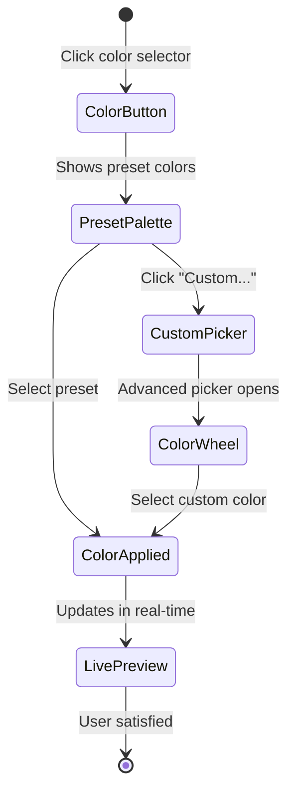

# UI/UX Design: Text Input Enhancements

## Design Principles

### Core Principles
1. **Progressive Disclosure**: Basic features immediately accessible, advanced features revealed as needed
2. **Visual Feedback**: Instant preview of all style changes
3. **Child-Safe Design**: Playful but professional, avoiding overwhelming complexity
4. **Accessibility First**: High contrast, clear labeling, keyboard navigation
5. **Mobile-Responsive**: Touch-friendly controls that work across all devices

## User Interface Layout

### Enhanced TextBlockEditor Dialog

```
┌─────────────────────────────────────────────────────────────┐
│ Edit Text Block                                         [X] │
├─────────────────────────────────────────────────────────────┤
│ ┌───────────────────────────────────────────────────────┐  │
│ │ [Content] [Style] [Variants] [Vocabulary] [Preview]   │  │
│ └───────────────────────────────────────────────────────┘  │
│                                                             │
│ ╔═══════════════════════════════════════════════════════╗  │
│ ║                    STYLE TAB                          ║  │
│ ╠═══════════════════════════════════════════════════════╣  │
│ ║                                                       ║  │
│ ║  Background Settings                                  ║  │
│ ║  ┌─────────────────────────────────────────────┐    ║  │
│ ║  │ Type: [●Solid] [○Gradient] [○Image] [○None] │    ║  │
│ ║  └─────────────────────────────────────────────┘    ║  │
│ ║                                                       ║  │
│ ║  Color:     [████████] #4A90E2  [Presets ▼]        ║  │
│ ║  Opacity:   [════════━━] 80%                        ║  │
│ ║  Blur:      [══━━━━━━━━] 2px                       ║  │
│ ║  Corners:   [═════━━━━━] 8px                        ║  │
│ ║  Padding:   [T:8] [R:12] [B:8] [L:12]              ║  │
│ ║                                                       ║  │
│ ║  Text Styling                                        ║  │
│ ║  ┌─────────────────────────────────────────────┐    ║  │
│ ║  │ Color: [████] Size: [16px▼] Weight: [500▼]  │    ║  │
│ ║  │ Shadow: [○None] [●Soft] [○Hard]             │    ║  │
│ ║  └─────────────────────────────────────────────┘    ║  │
│ ║                                                       ║  │
│ ║  Effects & Animation                                 ║  │
│ ║  ┌─────────────────────────────────────────────┐    ║  │
│ ║  │ [□] Glow effect    Intensity: [══━━━]       │    ║  │
│ ║  │ [✓] Pulse animation Speed: [Normal ▼]       │    ║  │
│ ║  └─────────────────────────────────────────────┘    ║  │
│ ║                                                       ║  │
│ ║  Style Presets                                       ║  │
│ ║  ┌─────────────────────────────────────────────┐    ║  │
│ ║  │ [Vocabulary] [Dialogue] [Emphasis] [Title]  │    ║  │
│ ║  │ [+Custom]   [Import]   [Export]             │    ║  │
│ ║  └─────────────────────────────────────────────┘    ║  │
│ ╚═══════════════════════════════════════════════════════╝  │
│                                                             │
│ Preview:                                                    │
│ ┌───────────────────────────────────────────────────────┐  │
│ │  The brave knight rode through the enchanted forest   │  │
│ └───────────────────────────────────────────────────────┘  │
│                                                             │
│ [Cancel]                              [Apply] [Save & Close]│
└─────────────────────────────────────────────────────────────┘
```

### Variant Management Tab

```
╔═══════════════════════════════════════════════════════════╗
║                    VARIANTS TAB                           ║
╠═══════════════════════════════════════════════════════════╣
║                                                           ║
║  Current Variants (4)                    [+ Add Variant] ║
║  ┌─────────────────────────────────────────────────────┐ ║
║  │ ┌───────────────────────────────────────────────┐ │ ║
║  │ │ 1. [Easy] Age 3-5                     [✓][⋮] │ │ ║
║  │ │ "The knight went to the forest"              │ │ ║
║  │ │ Words: 6 | Reading time: 2s                  │ │ ║
║  │ └───────────────────────────────────────────────┘ │ ║
║  │                                                   │ ║
║  │ ┌───────────────────────────────────────────────┐ │ ║
║  │ │ 2. [Medium] Age 6-8                   [○][⋮] │ │ ║
║  │ │ "The brave knight rode through the forest"   │ │ ║
║  │ │ Words: 8 | Reading time: 3s                  │ │ ║
║  │ └───────────────────────────────────────────────┘ │ ║
║  │                                                   │ ║
║  │ ┌───────────────────────────────────────────────┐ │ ║
║  │ │ 3. [Hard] Age 9-12                    [○][⋮] │ │ ║
║  │ │ "The courageous knight journeyed through..." │ │ ║
║  │ │ Words: 12 | Reading time: 4s                 │ │ ║
║  │ └───────────────────────────────────────────────┘ │ ║
║  │                                                   │ ║
║  │ ┌───────────────────────────────────────────────┐ │ ║
║  │ │ 4. [Custom] "Adventure"                [○][⋮] │ │ ║
║  │ │ "The valiant warrior ventured into the..."   │ │ ║
║  │ │ Words: 15 | Reading time: 5s                 │ │ ║
║  │ └───────────────────────────────────────────────┘ │ ║
║  └─────────────────────────────────────────────────────┘ ║
║                                                           ║
║  Bulk Actions: [Duplicate] [Export] [Import] [Delete]    ║
║                                                           ║
║  AI Suggestions (Beta)                    [Generate →]   ║
║  ┌─────────────────────────────────────────────────────┐ ║
║  │ Based on your current variants, AI can suggest:    │ ║
║  │ • Simplified version for emergent readers          │ ║
║  │ • Advanced version with complex vocabulary         │ ║
║  │ • Rhyming version for phonics practice            │ ║
║  └─────────────────────────────────────────────────────┘ ║
╚═══════════════════════════════════════════════════════════╝
```

### Inline Style Panel (Quick Access)

```
┌─────────────────────────────────────┐
│ Quick Style                    [×] │
├─────────────────────────────────────┤
│ Background                          │
│ ┌───────────────────────────────┐  │
│ │ ████ ████ ████ ████ ████ ████ │  │
│ │ ████ ████ ████ ████ ████ ████ │  │
│ └───────────────────────────────┘  │
│ [Custom Color...]                   │
│                                     │
│ Opacity: [════════━━] 80%          │
│                                     │
│ Quick Effects:                     │
│ [Highlight] [Shadow] [Glow]        │
│                                     │
│ Presets:                           │
│ [Vocab] [Important] [Fun]          │
│                                     │
│ [Advanced Settings...]              │
└─────────────────────────────────────┘
```

## Interaction Patterns

### Color Selection Flow



### Variant Creation Workflow

1. **Quick Add**
   - Click "Add Variant" button
   - System duplicates current active variant
   - Opens inline editor with duplicated text
   - User modifies text
   - Auto-calculates metadata (word count, complexity)
   - Saves on blur or Enter key

2. **Guided Creation**
   - Click "Add Variant" → "Guided"
   - Wizard opens with steps:
     - Step 1: Select target audience (age/level)
     - Step 2: Enter text content
     - Step 3: Tag vocabulary words
     - Step 4: Review and confirm
   - System suggests improvements
   - Creates variant with full metadata

3. **AI-Assisted Creation**
   - Click "Generate with AI"
   - Select generation type:
     - Simplify (make easier)
     - Enhance (make harder)
     - Translate (different style)
   - AI generates suggestion
   - User can edit before accepting
   - Saves with AI-generated flag

### Style Application Methods

#### Method 1: Direct Selection
```
User Action: Click text block → Style button
System Response: Opens quick style panel
User Action: Selects background color
System Response: Immediately applies to text block
```

#### Method 2: Drag and Drop
```
User Action: Drags style preset onto text block
System Response: Shows drop zone highlight
User Action: Drops preset
System Response: Applies style with animation
```

#### Method 3: Keyboard Shortcuts
```
Ctrl/Cmd + B: Toggle background panel
Ctrl/Cmd + Shift + S: Save current style as preset
Ctrl/Cmd + Alt + C: Copy style
Ctrl/Cmd + Alt + V: Paste style
```

## Visual Design Specifications

### Color Palette

```scss
// Primary Actions
$primary-blue: #4A90E2;
$primary-hover: #357ABD;
$primary-active: #2968A8;

// Text Backgrounds
$vocab-yellow: #FFF3CD;
$emphasis-green: #D4EDDA;
$dialogue-blue: #D1ECF1;
$warning-red: #F8D7DA;

// Neutral
$text-primary: #2C3E50;
$text-secondary: #6C757D;
$border-color: #DEE2E6;
$background: #F8F9FA;

// Accessibility
$focus-outline: #0056B3;
$error: #DC3545;
$success: #28A745;
```

### Typography

```scss
// Headings
.dialog-title {
  font-family: 'Nunito', sans-serif;
  font-size: 20px;
  font-weight: 700;
  color: $text-primary;
}

// Labels
.field-label {
  font-family: 'Open Sans', sans-serif;
  font-size: 12px;
  font-weight: 600;
  text-transform: uppercase;
  letter-spacing: 0.5px;
  color: $text-secondary;
}

// Text Preview
.text-preview {
  font-family: 'Merriweather', serif;
  font-size: 16px;
  line-height: 1.6;
  color: $text-primary;
}
```

### Component Styling

#### Background Style Picker
```scss
.background-picker {
  display: grid;
  grid-template-columns: repeat(6, 1fr);
  gap: 8px;
  padding: 12px;
  
  .color-swatch {
    width: 40px;
    height: 40px;
    border-radius: 8px;
    cursor: pointer;
    border: 2px solid transparent;
    transition: all 0.2s ease;
    
    &:hover {
      transform: scale(1.1);
      box-shadow: 0 4px 8px rgba(0,0,0,0.15);
    }
    
    &.selected {
      border-color: $primary-blue;
      box-shadow: 0 0 0 3px rgba(74, 144, 226, 0.2);
    }
  }
}
```

#### Variant Card
```scss
.variant-card {
  background: white;
  border: 1px solid $border-color;
  border-radius: 8px;
  padding: 16px;
  margin-bottom: 12px;
  transition: all 0.2s ease;
  
  &:hover {
    box-shadow: 0 2px 8px rgba(0,0,0,0.1);
    
    .variant-actions {
      opacity: 1;
    }
  }
  
  &.active {
    border-color: $primary-blue;
    background: linear-gradient(135deg, transparent 0%, rgba(74, 144, 226, 0.05) 100%);
  }
  
  .variant-header {
    display: flex;
    justify-content: space-between;
    align-items: center;
    margin-bottom: 8px;
  }
  
  .variant-badge {
    display: inline-block;
    padding: 2px 8px;
    border-radius: 12px;
    font-size: 11px;
    font-weight: 600;
    text-transform: uppercase;
    
    &.easy {
      background: #D4EDDA;
      color: #155724;
    }
    
    &.medium {
      background: #FFF3CD;
      color: #856404;
    }
    
    &.hard {
      background: #F8D7DA;
      color: #721C24;
    }
  }
  
  .variant-content {
    font-size: 14px;
    line-height: 1.5;
    color: $text-primary;
    margin-bottom: 8px;
  }
  
  .variant-metadata {
    display: flex;
    gap: 16px;
    font-size: 12px;
    color: $text-secondary;
  }
  
  .variant-actions {
    opacity: 0;
    transition: opacity 0.2s ease;
  }
}
```

## Responsive Design

### Mobile Adaptations

#### Phone (< 768px)
- Full-screen modal for text editing
- Stacked tabs instead of horizontal
- Touch-friendly controls (min 44px tap targets)
- Simplified color picker with preset-first approach
- Swipe gestures for variant navigation

#### Tablet (768px - 1024px)
- Side panel for style controls
- Two-column layout for variants
- Floating action buttons
- Touch-optimized sliders

#### Desktop (> 1024px)
- Multi-panel layout
- Keyboard shortcuts enabled
- Hover states for all interactive elements
- Drag-and-drop functionality
- Advanced features visible by default

### Responsive Breakpoints

```scss
// Breakpoint variables
$breakpoint-xs: 0;
$breakpoint-sm: 576px;
$breakpoint-md: 768px;
$breakpoint-lg: 1024px;
$breakpoint-xl: 1280px;
$breakpoint-xxl: 1536px;

// Responsive mixins
@mixin responsive($breakpoint) {
  @if $breakpoint == 'phone' {
    @media (max-width: $breakpoint-md - 1px) { @content; }
  }
  @else if $breakpoint == 'tablet' {
    @media (min-width: $breakpoint-md) and (max-width: $breakpoint-lg - 1px) { @content; }
  }
  @else if $breakpoint == 'desktop' {
    @media (min-width: $breakpoint-lg) { @content; }
  }
}

// Usage example
.text-editor-dialog {
  width: 90%;
  max-width: 800px;
  
  @include responsive('phone') {
    width: 100%;
    height: 100%;
    max-width: none;
    border-radius: 0;
  }
  
  @include responsive('tablet') {
    width: 80%;
    max-width: 600px;
  }
}
```

## Animation and Transitions

### Style Application Animation

```scss
@keyframes styleApply {
  0% {
    opacity: 0.7;
    transform: scale(0.95);
  }
  50% {
    opacity: 1;
    transform: scale(1.02);
  }
  100% {
    opacity: 1;
    transform: scale(1);
  }
}

.text-block-styled {
  animation: styleApply 0.3s ease-out;
}
```

### Background Pulse Effect

```scss
@keyframes backgroundPulse {
  0%, 100% {
    opacity: var(--bg-opacity, 0.8);
  }
  50% {
    opacity: calc(var(--bg-opacity, 0.8) * 0.7);
  }
}

.text-background-pulse {
  animation: backgroundPulse 2s ease-in-out infinite;
}
```

### Variant Switch Transition

```scss
.variant-transition {
  position: relative;
  
  .variant-text-exit {
    position: absolute;
    opacity: 1;
    transform: translateX(0);
    transition: all 0.3s ease-out;
  }
  
  .variant-text-exit-active {
    opacity: 0;
    transform: translateX(-20px);
  }
  
  .variant-text-enter {
    opacity: 0;
    transform: translateX(20px);
    transition: all 0.3s ease-out;
  }
  
  .variant-text-enter-active {
    opacity: 1;
    transform: translateX(0);
  }
}
```

## Accessibility Features

### Keyboard Navigation

```typescript
// Keyboard navigation map
const keyboardShortcuts = {
  'Tab': 'Next element',
  'Shift+Tab': 'Previous element',
  'Enter': 'Activate/Submit',
  'Space': 'Toggle selection',
  'Escape': 'Close dialog/Cancel',
  'Arrow Up/Down': 'Navigate variants',
  'Ctrl+S': 'Save changes',
  'Ctrl+Z': 'Undo',
  'Ctrl+Shift+Z': 'Redo',
  'Ctrl+D': 'Duplicate variant',
  'Delete': 'Delete selected'
}
```

### ARIA Labels

```html
<!-- Style Panel -->
<div role="region" aria-label="Text style settings">
  <div role="group" aria-label="Background settings">
    <label for="bg-color" id="bg-color-label">Background Color</label>
    <input 
      type="color" 
      id="bg-color"
      aria-labelledby="bg-color-label"
      aria-describedby="bg-color-desc"
    />
    <span id="bg-color-desc" class="sr-only">
      Select a background color for the text block
    </span>
  </div>
  
  <div role="group" aria-label="Opacity control">
    <label for="opacity-slider">Opacity: <span aria-live="polite">80%</span></label>
    <input 
      type="range" 
      id="opacity-slider"
      min="0" 
      max="100" 
      value="80"
      aria-valuemin="0"
      aria-valuemax="100"
      aria-valuenow="80"
      aria-valuetext="80 percent"
    />
  </div>
</div>

<!-- Variant List -->
<div role="list" aria-label="Text variants">
  <div role="listitem" aria-selected="true" tabindex="0">
    <span class="sr-only">Selected variant:</span>
    <div aria-label="Easy difficulty, age 3 to 5">
      The knight went to the forest
    </div>
  </div>
</div>
```

### Screen Reader Announcements

```typescript
class ScreenReaderAnnouncer {
  private announcer: HTMLElement
  
  constructor() {
    this.announcer = document.createElement('div')
    this.announcer.setAttribute('role', 'status')
    this.announcer.setAttribute('aria-live', 'polite')
    this.announcer.setAttribute('aria-atomic', 'true')
    this.announcer.className = 'sr-only'
    document.body.appendChild(this.announcer)
  }
  
  announce(message: string, priority: 'polite' | 'assertive' = 'polite'): void {
    this.announcer.setAttribute('aria-live', priority)
    this.announcer.textContent = message
    
    // Clear after announcement
    setTimeout(() => {
      this.announcer.textContent = ''
    }, 1000)
  }
}

// Usage
const announcer = new ScreenReaderAnnouncer()
announcer.announce('Background color changed to blue')
announcer.announce('Variant 2 selected: Medium difficulty')
announcer.announce('Style saved successfully', 'assertive')
```

## Error States and Validation

### Visual Error Indicators

```scss
.field-error {
  border-color: $error !important;
  box-shadow: 0 0 0 3px rgba(220, 53, 69, 0.25);
  
  &:focus {
    box-shadow: 0 0 0 3px rgba(220, 53, 69, 0.25);
  }
}

.error-message {
  color: $error;
  font-size: 12px;
  margin-top: 4px;
  display: flex;
  align-items: center;
  
  &::before {
    content: '⚠';
    margin-right: 4px;
  }
}
```

### Validation Messages

```typescript
const validationMessages = {
  opacity: {
    min: 'Opacity cannot be less than 0%',
    max: 'Opacity cannot exceed 100%'
  },
  variant: {
    empty: 'Variant text cannot be empty',
    duplicate: 'This variant already exists',
    tooLong: 'Variant exceeds maximum length (500 characters)',
    invalidChars: 'Variant contains invalid characters'
  },
  color: {
    invalid: 'Please enter a valid color value',
    contrast: 'Text color has insufficient contrast with background'
  }
}
```

## Performance Optimizations

### Debounced Updates

```typescript
// Debounce style updates to prevent excessive re-renders
const debouncedStyleUpdate = useMemo(
  () => debounce((style: TextBlockStyle) => {
    onStyleChange(style)
  }, 300),
  [onStyleChange]
)

// Throttle preview updates for smooth performance
const throttledPreviewUpdate = useMemo(
  () => throttle((style: TextBlockStyle) => {
    updatePreview(style)
  }, 16), // 60fps
  []
)
```

### Lazy Loading

```typescript
// Lazy load advanced features
const GradientEditor = lazy(() => import('./GradientEditor'))
const AnimationSelector = lazy(() => import('./AnimationSelector'))
const AIVariantGenerator = lazy(() => import('./AIVariantGenerator'))

// Usage with Suspense
<Suspense fallback={<LoadingSpinner />}>
  {showGradientEditor && <GradientEditor />}
</Suspense>
```

## User Onboarding

### First-Time User Tutorial

```typescript
const tutorialSteps = [
  {
    target: '.add-variant-button',
    title: 'Create Text Variants',
    content: 'Add different versions of your text for various reading levels',
    placement: 'bottom'
  },
  {
    target: '.background-picker',
    title: 'Style Your Text',
    content: 'Add colorful backgrounds to make important text stand out',
    placement: 'top'
  },
  {
    target: '.preset-selector',
    title: 'Use Style Presets',
    content: 'Quickly apply pre-designed styles or save your own',
    placement: 'left'
  },
  {
    target: '.preview-panel',
    title: 'Preview Changes',
    content: 'See how your text will look in real-time',
    placement: 'right'
  }
]
```

### Tooltips and Help Text

```typescript
const helpTooltips = {
  opacity: 'Adjust how transparent the background appears (0% = invisible, 100% = solid)',
  blur: 'Add a soft blur effect behind the text for better readability',
  variants: 'Create multiple versions of text that adapt to different reading levels',
  gradient: 'Apply a smooth color transition as the background',
  animation: 'Add subtle movement to draw attention to important text'
}
```

## Testing Considerations

### User Testing Scenarios

1. **Parent creates vocabulary word highlight**
   - Opens text editor
   - Selects yellow background
   - Adjusts opacity to 60%
   - Saves style as "Vocabulary" preset
   - Applies to multiple text blocks

2. **Parent adds reading level variants**
   - Creates base text
   - Adds "Easy" variant with simpler words
   - Adds "Hard" variant with complex vocabulary
   - Tests preview for each level
   - Assigns to different children

3. **Mobile user edits text style**
   - Opens editor on phone
   - Uses touch to select colors
   - Adjusts sliders with finger
   - Previews on small screen
   - Saves successfully

### Accessibility Testing

- Keyboard-only navigation
- Screen reader compatibility
- Color contrast validation
- Focus indicator visibility
- Touch target size verification
- Reduced motion support

### Performance Testing

- Load time with 100+ text blocks
- Style computation speed
- Animation frame rate
- Memory usage monitoring
- Network request optimization