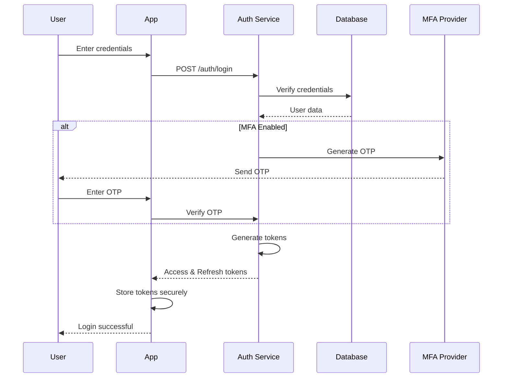

# WonderNest Technical Architecture Document
## Detailed System Design & Implementation Specifications

---

# 1. Executive Technical Summary

WonderNest's technical architecture is designed as a privacy-first, scalable platform combining edge computing for sensitive audio processing with cloud infrastructure for content delivery and analytics. The system prioritizes child safety, data privacy, and real-time performance while maintaining cost efficiency at scale.

## Key Technical Decisions
- **Hybrid Processing**: Audio analysis split between on-device (privacy) and cloud (advanced features)
- **Microservices**: Loosely coupled services for independent scaling and development
- **Flutter**: Single codebase for iOS/Android with native performance
- **Event-Driven**: Real-time updates via WebSockets and message queues
- **Privacy-First**: COPPA-compliant architecture with data minimization

---

# 2. System Architecture

## 2.1 High-Level Architecture

```
┌──────────────────────────────────────────────────────────────┐
│                         Clients                              │
├────────────────┬────────────────┬────────────────────────────┤
│   Mobile Apps  │   Web Portal   │   Smart Devices           │
│  (iOS/Android) │   (React SPA)  │  (Alexa/Google/Watch)     │
└────────────────┴────────────────┴────────────────────────────┘
                            │
                 ┌──────────▼──────────┐
                 │   Load Balancer     │
                 │  (AWS ALB + WAF)    │
                 └──────────┬──────────┘
                            │
                 ┌──────────▼──────────┐
                 │    API Gateway      │
                 │  (Kong + Rate Limit) │
                 └──────────┬──────────┘
                            │
┌───────────────────────────┴───────────────────────────────────┐
│                    Service Layer                              │
├──────────┬──────────┬──────────┬──────────┬─────────────────┤
│   Auth   │ Content  │  Audio   │Analytics │  Notification   │
│ Service  │ Service  │ Service  │ Service  │   Service       │
├──────────┼──────────┼──────────┼──────────┼─────────────────┤
│  User    │ Parent   │ Payment  │  Admin   │   Support       │
│ Service  │ Portal   │ Service  │ Service  │   Service       │
└──────────┴──────────┴──────────┴──────────┴─────────────────┘
                            │
                 ┌──────────▼──────────┐
                 │   Message Queue     │
                 │   (AWS SQS/SNS)     │
                 └──────────┬──────────┘
                            │
┌───────────────────────────┴───────────────────────────────────┐
│                      Data Layer                               │
├────────────┬────────────┬────────────┬──────────────────────┤
│PostgreSQL  │  MongoDB   │   Redis    │    S3 + CloudFront   │
│(Primary)   │ (Content)  │  (Cache)   │    (Media/Static)    │
├────────────┼────────────┼────────────┼──────────────────────┤
│ClickHouse │Elasticsearch│ DynamoDB  │     AWS Kinesis      │
│(Analytics) │  (Search)  │  (Session) │    (Streaming)       │
└────────────┴────────────┴────────────┴──────────────────────┘
```

## 2.2 Network Architecture

### CDN Strategy
```
Users → CloudFront → Origin
         ↓
    Edge Locations
    - Static assets
    - Video content
    - API caching
    - Geo-blocking
```

### Security Layers
1. **WAF Rules**: OWASP Top 10 protection
2. **DDoS Protection**: AWS Shield Standard
3. **Rate Limiting**: Kong plugin (100 req/min)
4. **API Keys**: Rotating JWT tokens
5. **VPC**: Private subnets for services

---

# 3. Mobile Application Architecture

## 3.1 Flutter Application Structure

### Project Organization
```
wondernest_app/
├── lib/
│   ├── core/
│   │   ├── constants/
│   │   │   ├── api_endpoints.dart
│   │   │   ├── app_colors.dart
│   │   │   └── app_strings.dart
│   │   ├── errors/
│   │   │   ├── exceptions.dart
│   │   │   └── failures.dart
│   │   ├── network/
│   │   │   ├── api_client.dart
│   │   │   ├── network_info.dart
│   │   │   └── interceptors.dart
│   │   ├── audio/
│   │   │   ├── audio_processor.dart
│   │   │   ├── speech_analyzer.dart
│   │   │   └── privacy_filter.dart
│   │   └── utils/
│   │       ├── validators.dart
│   │       ├── formatters.dart
│   │       └── extensions.dart
│   ├── features/
│   │   ├── authentication/
│   │   │   ├── data/
│   │   │   │   ├── datasources/
│   │   │   │   ├── models/
│   │   │   │   └── repositories/
│   │   │   ├── domain/
│   │   │   │   ├── entities/
│   │   │   │   ├── repositories/
│   │   │   │   └── usecases/
│   │   │   └── presentation/
│   │   │       ├── bloc/
│   │   │       ├── pages/
│   │   │       └── widgets/
│   │   ├── content_library/
│   │   ├── audio_analysis/
│   │   ├── parent_dashboard/
│   │   ├── child_mode/
│   │   └── settings/
│   ├── shared/
│   │   ├── widgets/
│   │   ├── themes/
│   │   └── animations/
│   └── main.dart
├── android/
│   ├── app/
│   │   └── src/main/kotlin/
│   │       └── AudioService.kt
├── ios/
│   ├── Runner/
│   │   └── AudioProcessor.swift
├── test/
├── assets/
└── pubspec.yaml
```

### Key Dependencies
```yaml
dependencies:
  flutter: sdk
  
  # State Management
  flutter_bloc: ^8.1.0
  equatable: ^2.0.5
  
  # Networking
  dio: ^5.0.0
  retrofit: ^4.0.1
  
  # Local Storage
  hive_flutter: ^1.1.0
  sqflite: ^2.2.0
  
  # Audio Processing
  flutter_sound: ^9.2.0
  permission_handler: ^10.2.0
  
  # ML/AI
  tflite_flutter: ^0.9.0
  
  # UI/UX
  cached_network_image: ^3.2.0
  lottie: ^2.2.0
  shimmer: ^2.0.0
  
  # Security
  flutter_secure_storage: ^8.0.0
  crypto: ^3.0.2
  
  # Analytics
  firebase_analytics: ^10.1.0
  mixpanel_flutter: ^2.0.0
```

## 3.2 Audio Processing Architecture

### On-Device Processing Pipeline
```dart
class AudioProcessor {
  final _audioRecorder = FlutterSoundRecorder();
  final _speechAnalyzer = SpeechAnalyzer();
  final _privacyFilter = PrivacyFilter();
  
  Stream<AudioMetrics> processAudioStream() async* {
    await _initializeRecorder();
    
    await for (final audioBuffer in _audioRecorder.onProgress!) {
      // Step 1: Privacy filtering
      final filtered = await _privacyFilter.removePersonalInfo(audioBuffer);
      
      // Step 2: Feature extraction
      final features = await _extractFeatures(filtered);
      
      // Step 3: Local ML inference
      final metrics = await _speechAnalyzer.analyze(features);
      
      // Step 4: Delete raw audio
      audioBuffer.dispose();
      
      // Step 5: Yield metrics only
      yield metrics;
    }
  }
  
  Future<AudioFeatures> _extractFeatures(AudioBuffer buffer) async {
    return AudioFeatures(
      mfcc: await _calculateMFCC(buffer),
      spectralCentroid: await _calculateSpectralCentroid(buffer),
      zeroCrossingRate: await _calculateZCR(buffer),
      energy: await _calculateEnergy(buffer),
    );
  }
}
```

### ML Model Integration
```dart
class SpeechAnalyzer {
  late Interpreter _interpreter;
  
  Future<void> initialize() async {
    // Load TensorFlow Lite model
    _interpreter = await Interpreter.fromAsset('models/speech_model.tflite');
  }
  
  Future<AudioMetrics> analyze(AudioFeatures features) async {
    // Prepare input tensor
    final input = features.toTensor();
    final output = List.filled(1 * 10, 0).reshape([1, 10]);
    
    // Run inference
    _interpreter.run(input, output);
    
    // Parse results
    return AudioMetrics(
      wordCount: _extractWordCount(output),
      speakerTurns: _extractSpeakerTurns(output),
      vocabularyDiversity: _extractVocabularyDiversity(output),
      silenceRatio: _extractSilenceRatio(output),
    );
  }
}
```

## 3.3 Child Safety Implementation

### Kiosk Mode
```dart
class ChildModeManager {
  static void enterChildMode() {
    if (Platform.isAndroid) {
      // Android kiosk mode
      SystemChrome.setEnabledSystemUIMode(SystemUiMode.immersive);
      _startLockTask();
    } else if (Platform.isIOS) {
      // iOS guided access
      _enableGuidedAccess();
    }
    
    // Disable system gestures
    _disableSystemGestures();
    
    // Start session timer
    _startSessionTimer();
  }
  
  static void _startLockTask() {
    const platform = MethodChannel('com.wondernest/kiosk');
    platform.invokeMethod('startLockTask');
  }
  
  static void _disableSystemGestures() {
    SystemChrome.setPreferredOrientations([
      DeviceOrientation.portraitUp,
    ]);
    
    // Custom gesture recognizer
    GestureBinding.instance.gestures.clear();
  }
}
```

### Content Filtering
```dart
class ContentFilter {
  final List<String> _blockedDomains = [];
  final List<String> _allowedDomains = [];
  
  Future<bool> isContentSafe(String url) async {
    // Check domain lists
    final domain = Uri.parse(url).host;
    
    if (_blockedDomains.contains(domain)) {
      return false;
    }
    
    if (_allowedDomains.isNotEmpty && !_allowedDomains.contains(domain)) {
      return false;
    }
    
    // Check content rating
    final rating = await _getContentRating(url);
    return rating.isAppropriate;
  }
  
  Future<void> filterWebView(WebViewController controller) async {
    await controller.setNavigationDelegate(
      NavigationDelegate(
        onNavigationRequest: (NavigationRequest request) async {
          if (await isContentSafe(request.url)) {
            return NavigationDecision.navigate;
          }
          return NavigationDecision.prevent;
        },
      ),
    );
  }
}
```

---

# 4. Backend Services Architecture

## 4.1 Microservices Detailed Design

### Authentication Service
```typescript
// Node.js + TypeScript
interface AuthService {
  // User Management
  signup(email: string, password: string): Promise<User>;
  login(email: string, password: string): Promise<AuthToken>;
  refresh(refreshToken: string): Promise<AuthToken>;
  logout(userId: string): Promise<void>;
  
  // MFA
  enableMFA(userId: string): Promise<MFASecret>;
  verifyMFA(userId: string, code: string): Promise<boolean>;
  
  // Social Auth
  googleAuth(idToken: string): Promise<AuthToken>;
  appleAuth(identityToken: string): Promise<AuthToken>;
  
  // Parent Verification
  verifyParent(userId: string, method: VerificationMethod): Promise<boolean>;
}

class AuthServiceImpl implements AuthService {
  private readonly userRepo: UserRepository;
  private readonly tokenService: TokenService;
  private readonly emailService: EmailService;
  
  async signup(email: string, password: string): Promise<User> {
    // Validate email
    if (!this.isValidEmail(email)) {
      throw new ValidationError('Invalid email');
    }
    
    // Check existing user
    const existing = await this.userRepo.findByEmail(email);
    if (existing) {
      throw new ConflictError('Email already registered');
    }
    
    // Hash password
    const hashedPassword = await bcrypt.hash(password, 12);
    
    // Create user
    const user = await this.userRepo.create({
      email,
      password: hashedPassword,
      emailVerified: false,
      createdAt: new Date(),
    });
    
    // Send verification email
    await this.emailService.sendVerification(user);
    
    return user;
  }
  
  // ... other methods
}
```

### Content Management Service
```python
# Python + FastAPI
from fastapi import FastAPI, HTTPException
from typing import List, Optional
import asyncio
from motor.motor_asyncio import AsyncIOMotorClient

app = FastAPI()

class ContentService:
    def __init__(self):
        self.db = AsyncIOMotorClient('mongodb://localhost:27017')
        self.content_db = self.db.wondernest.content
        self.recommendation_engine = RecommendationEngine()
    
    async def get_content_library(
        self,
        age_range: tuple,
        categories: List[str],
        limit: int = 50
    ) -> List[Content]:
        """Get curated content for specific age and categories"""
        query = {
            "min_age": {"$lte": age_range[1]},
            "max_age": {"$gte": age_range[0]},
            "category": {"$in": categories},
            "status": "approved",
            "safety_score": {"$gte": 0.95}
        }
        
        cursor = self.content_db.find(query).limit(limit)
        content = await cursor.to_list(length=limit)
        
        return [Content.from_dict(c) for c in content]
    
    async def add_content(self, content: ContentInput) -> Content:
        """Add new content with safety verification"""
        # Safety check
        safety_score = await self.verify_content_safety(content)
        if safety_score < 0.95:
            raise HTTPException(400, "Content failed safety check")
        
        # Extract metadata
        metadata = await self.extract_metadata(content)
        
        # Store content
        doc = {
            **content.dict(),
            "metadata": metadata,
            "safety_score": safety_score,
            "created_at": datetime.utcnow(),
            "status": "pending_review"
        }
        
        result = await self.content_db.insert_one(doc)
        return Content.from_dict(doc)
    
    async def get_recommendations(
        self,
        child_id: str,
        limit: int = 10
    ) -> List[Content]:
        """Get personalized content recommendations"""
        # Get child profile
        child = await self.get_child_profile(child_id)
        
        # Get interaction history
        history = await self.get_interaction_history(child_id)
        
        # Generate recommendations
        recommendations = await self.recommendation_engine.predict(
            child_profile=child,
            history=history,
            limit=limit
        )
        
        return recommendations
    
    async def verify_content_safety(self, content: ContentInput) -> float:
        """Verify content safety using ML models"""
        checks = await asyncio.gather(
            self.check_inappropriate_content(content),
            self.check_violence_level(content),
            self.check_age_appropriateness(content),
            self.check_advertising_content(content)
        )
        
        return min(checks)  # Return lowest score
```

### Audio Processing Service
```python
class AudioProcessingService:
    def __init__(self):
        self.whisper_model = whisper.load_model("base")
        self.speaker_model = SpeakerIdentification()
        self.emotion_model = EmotionRecognition()
        
    async def process_audio_chunk(
        self,
        audio_data: bytes,
        child_id: str,
        session_id: str
    ) -> AudioAnalysis:
        """Process audio chunk with privacy preservation"""
        
        # Step 1: Convert to numpy array
        audio_array = np.frombuffer(audio_data, dtype=np.float32)
        
        # Step 2: Voice activity detection
        vad_segments = self.detect_voice_activity(audio_array)
        
        # Step 3: Process only voice segments
        analysis_results = []
        for segment in vad_segments:
            # Transcribe
            transcript = await self.transcribe_segment(segment)
            
            # Speaker identification
            speaker_id = await self.identify_speaker(segment)
            
            # Extract features (no PII)
            features = self.extract_features(transcript, speaker_id)
            
            analysis_results.append(features)
        
        # Step 4: Aggregate results
        aggregated = self.aggregate_analysis(analysis_results)
        
        # Step 5: Store metrics only (no audio)
        await self.store_metrics(child_id, session_id, aggregated)
        
        # Step 6: Delete audio data
        del audio_data, audio_array
        
        return AudioAnalysis(
            session_id=session_id,
            metrics=aggregated,
            timestamp=datetime.utcnow()
        )
    
    def extract_features(self, transcript: str, speaker_id: str) -> dict:
        """Extract non-PII features from transcript"""
        return {
            "word_count": len(transcript.split()),
            "unique_words": len(set(transcript.split())),
            "avg_word_length": np.mean([len(w) for w in transcript.split()]),
            "sentence_count": len(transcript.split('.')),
            "question_count": transcript.count('?'),
            "speaker_type": self.classify_speaker(speaker_id),
            # No actual words or content stored
        }
```

### Analytics Service
```go
// Go + ClickHouse
package analytics

type AnalyticsService struct {
    clickhouse *clickhouse.Conn
    redis      *redis.Client
    kafka      *kafka.Producer
}

func (s *AnalyticsService) TrackEvent(event Event) error {
    // Real-time processing
    go s.processRealtime(event)
    
    // Batch processing
    if err := s.kafka.Produce(&kafka.Message{
        Topic: "events",
        Value: event.Marshal(),
    }); err != nil {
        return err
    }
    
    return nil
}

func (s *AnalyticsService) GetChildAnalytics(childID string, period string) (*Analytics, error) {
    query := `
        SELECT 
            toDate(timestamp) as date,
            sum(word_count) as total_words,
            avg(vocabulary_diversity) as avg_diversity,
            sum(screen_time) as total_screen_time,
            count(distinct session_id) as sessions
        FROM child_metrics
        WHERE child_id = ? AND timestamp > now() - INTERVAL ?
        GROUP BY date
        ORDER BY date DESC
    `
    
    rows, err := s.clickhouse.Query(query, childID, period)
    if err != nil {
        return nil, err
    }
    
    analytics := &Analytics{
        ChildID: childID,
        Period:  period,
        Metrics: make([]DailyMetrics, 0),
    }
    
    for rows.Next() {
        var m DailyMetrics
        if err := rows.Scan(&m); err != nil {
            return nil, err
        }
        analytics.Metrics = append(analytics.Metrics, m)
    }
    
    return analytics, nil
}

func (s *AnalyticsService) GenerateInsights(childID string) (*Insights, error) {
    // Get historical data
    history, err := s.GetChildAnalytics(childID, "30 days")
    if err != nil {
        return nil, err
    }
    
    // Calculate trends
    trends := s.calculateTrends(history)
    
    // Generate recommendations
    recommendations := s.generateRecommendations(trends)
    
    // Predict milestones
    milestones := s.predictMilestones(history)
    
    return &Insights{
        Trends:          trends,
        Recommendations: recommendations,
        Milestones:      milestones,
    }, nil
}
```

## 4.2 Database Schema Design

### PostgreSQL Schema
```sql
-- Users and Authentication
CREATE TABLE users (
    id UUID PRIMARY KEY DEFAULT gen_random_uuid(),
    email VARCHAR(255) UNIQUE NOT NULL,
    password_hash VARCHAR(255) NOT NULL,
    email_verified BOOLEAN DEFAULT FALSE,
    mfa_enabled BOOLEAN DEFAULT FALSE,
    mfa_secret VARCHAR(255),
    created_at TIMESTAMP DEFAULT CURRENT_TIMESTAMP,
    updated_at TIMESTAMP DEFAULT CURRENT_TIMESTAMP,
    last_login TIMESTAMP,
    status VARCHAR(20) DEFAULT 'active'
);

CREATE TABLE parent_profiles (
    id UUID PRIMARY KEY DEFAULT gen_random_uuid(),
    user_id UUID REFERENCES users(id) ON DELETE CASCADE,
    first_name VARCHAR(100),
    last_name VARCHAR(100),
    phone VARCHAR(20),
    timezone VARCHAR(50),
    language VARCHAR(10) DEFAULT 'en',
    notification_preferences JSONB,
    created_at TIMESTAMP DEFAULT CURRENT_TIMESTAMP
);

CREATE TABLE children (
    id UUID PRIMARY KEY DEFAULT gen_random_uuid(),
    parent_id UUID REFERENCES parent_profiles(id) ON DELETE CASCADE,
    name VARCHAR(100) NOT NULL,
    birth_date DATE NOT NULL,
    gender VARCHAR(20),
    avatar_url VARCHAR(500),
    interests TEXT[],
    developmental_notes TEXT,
    created_at TIMESTAMP DEFAULT CURRENT_TIMESTAMP,
    updated_at TIMESTAMP DEFAULT CURRENT_TIMESTAMP
);

CREATE TABLE subscriptions (
    id UUID PRIMARY KEY DEFAULT gen_random_uuid(),
    user_id UUID REFERENCES users(id) ON DELETE CASCADE,
    plan_id VARCHAR(50) NOT NULL,
    status VARCHAR(20) NOT NULL,
    start_date TIMESTAMP NOT NULL,
    end_date TIMESTAMP,
    stripe_subscription_id VARCHAR(255),
    stripe_customer_id VARCHAR(255),
    amount_cents INTEGER,
    currency VARCHAR(3) DEFAULT 'USD',
    created_at TIMESTAMP DEFAULT CURRENT_TIMESTAMP
);

-- Audio Sessions
CREATE TABLE audio_sessions (
    id UUID PRIMARY KEY DEFAULT gen_random_uuid(),
    child_id UUID REFERENCES children(id) ON DELETE CASCADE,
    start_time TIMESTAMP NOT NULL,
    end_time TIMESTAMP,
    duration_seconds INTEGER,
    word_count INTEGER,
    unique_words INTEGER,
    conversation_turns INTEGER,
    silence_percentage DECIMAL(5,2),
    processed BOOLEAN DEFAULT FALSE,
    created_at TIMESTAMP DEFAULT CURRENT_TIMESTAMP
);

-- Content Engagement
CREATE TABLE content_sessions (
    id UUID PRIMARY KEY DEFAULT gen_random_uuid(),
    child_id UUID REFERENCES children(id) ON DELETE CASCADE,
    content_id VARCHAR(255) NOT NULL,
    start_time TIMESTAMP NOT NULL,
    end_time TIMESTAMP,
    duration_seconds INTEGER,
    completion_percentage DECIMAL(5,2),
    interaction_count INTEGER,
    created_at TIMESTAMP DEFAULT CURRENT_TIMESTAMP
);

-- Indexes for performance
CREATE INDEX idx_users_email ON users(email);
CREATE INDEX idx_children_parent ON children(parent_id);
CREATE INDEX idx_audio_sessions_child ON audio_sessions(child_id);
CREATE INDEX idx_audio_sessions_date ON audio_sessions(start_time);
CREATE INDEX idx_content_sessions_child ON content_sessions(child_id);
CREATE INDEX idx_subscriptions_user ON subscriptions(user_id);
CREATE INDEX idx_subscriptions_status ON subscriptions(status);
```

### MongoDB Schema
```javascript
// Content Collection
{
  _id: ObjectId,
  title: String,
  description: String,
  type: String, // 'video', 'game', 'book', 'activity'
  url: String,
  thumbnail_url: String,
  duration_seconds: Number,
  age_range: {
    min: Number,
    max: Number
  },
  categories: [String],
  tags: [String],
  educational_goals: [String],
  language: String,
  creator: {
    name: String,
    id: String,
    verified: Boolean
  },
  metadata: {
    resolution: String,
    file_size: Number,
    format: String
  },
  safety_score: Number,
  engagement_score: Number,
  reviews: [{
    parent_id: String,
    rating: Number,
    comment: String,
    date: Date
  }],
  status: String, // 'pending', 'approved', 'rejected'
  created_at: Date,
  updated_at: Date
}

// User Preferences Collection
{
  _id: ObjectId,
  user_id: String,
  child_id: String,
  content_preferences: {
    favorite_categories: [String],
    blocked_categories: [String],
    preferred_duration: Number,
    difficulty_level: String
  },
  interaction_history: [{
    content_id: String,
    timestamp: Date,
    duration: Number,
    completed: Boolean,
    rating: Number
  }],
  recommendations: {
    last_updated: Date,
    items: [String]
  }
}

// Analytics Events Collection
{
  _id: ObjectId,
  event_type: String,
  user_id: String,
  child_id: String,
  session_id: String,
  timestamp: Date,
  properties: {
    // Flexible schema for different event types
  },
  device_info: {
    platform: String,
    version: String,
    model: String
  },
  location: {
    country: String,
    region: String
  }
}
```

### Redis Cache Schema
```redis
# Session Storage
session:{session_id} -> JSON {
  user_id: string,
  child_id: string,
  start_time: timestamp,
  last_activity: timestamp,
  device_id: string
}
TTL: 24 hours

# Rate Limiting
rate_limit:{user_id}:{endpoint} -> counter
TTL: 60 seconds

# Content Cache
content:{content_id} -> JSON content_object
TTL: 1 hour

# Recommendation Cache  
recommendations:{child_id} -> JSON array
TTL: 30 minutes

# Real-time Analytics
analytics:realtime:{metric} -> value
TTL: 5 minutes

# Feature Flags
feature:{feature_name}:{user_id} -> boolean
TTL: 1 hour
```

## 4.3 API Specification

### RESTful API Design
```yaml
openapi: 3.0.0
info:
  title: WonderNest API
  version: 1.0.0
  
servers:
  - url: https://api.wondernest.com/v1
    description: Production
  - url: https://staging-api.wondernest.com/v1
    description: Staging

paths:
  /auth/signup:
    post:
      summary: Create new parent account
      requestBody:
        required: true
        content:
          application/json:
            schema:
              type: object
              properties:
                email:
                  type: string
                  format: email
                password:
                  type: string
                  minLength: 8
                timezone:
                  type: string
      responses:
        201:
          description: Account created
          content:
            application/json:
              schema:
                $ref: '#/components/schemas/AuthResponse'
                
  /children:
    get:
      summary: Get all children profiles
      security:
        - bearerAuth: []
      responses:
        200:
          description: List of children
          content:
            application/json:
              schema:
                type: array
                items:
                  $ref: '#/components/schemas/Child'
    
    post:
      summary: Create child profile
      security:
        - bearerAuth: []
      requestBody:
        required: true
        content:
          application/json:
            schema:
              $ref: '#/components/schemas/ChildInput'
      responses:
        201:
          description: Child profile created
          
  /content/library:
    get:
      summary: Get content library
      security:
        - bearerAuth: []
      parameters:
        - name: child_id
          in: query
          required: true
          schema:
            type: string
        - name: category
          in: query
          schema:
            type: string
        - name: limit
          in: query
          schema:
            type: integer
            default: 50
      responses:
        200:
          description: Content list
          content:
            application/json:
              schema:
                type: array
                items:
                  $ref: '#/components/schemas/Content'
                  
  /audio/session:
    post:
      summary: Start audio session
      security:
        - bearerAuth: []
      requestBody:
        required: true
        content:
          application/json:
            schema:
              type: object
              properties:
                child_id:
                  type: string
                device_id:
                  type: string
      responses:
        201:
          description: Session started
          content:
            application/json:
              schema:
                type: object
                properties:
                  session_id:
                    type: string
                  upload_url:
                    type: string
                    
  /audio/metrics:
    post:
      summary: Upload audio metrics
      security:
        - bearerAuth: []
      requestBody:
        required: true
        content:
          application/json:
            schema:
              $ref: '#/components/schemas/AudioMetrics'
      responses:
        201:
          description: Metrics stored

components:
  securitySchemes:
    bearerAuth:
      type: http
      scheme: bearer
      bearerFormat: JWT
      
  schemas:
    AuthResponse:
      type: object
      properties:
        access_token:
          type: string
        refresh_token:
          type: string
        expires_in:
          type: integer
        user:
          $ref: '#/components/schemas/User'
          
    User:
      type: object
      properties:
        id:
          type: string
        email:
          type: string
        email_verified:
          type: boolean
        created_at:
          type: string
          format: date-time
          
    Child:
      type: object
      properties:
        id:
          type: string
        name:
          type: string
        birth_date:
          type: string
          format: date
        avatar_url:
          type: string
        interests:
          type: array
          items:
            type: string
            
    Content:
      type: object
      properties:
        id:
          type: string
        title:
          type: string
        description:
          type: string
        type:
          type: string
          enum: [video, game, book, activity]
        url:
          type: string
        thumbnail_url:
          type: string
        duration_seconds:
          type: integer
        age_range:
          type: object
          properties:
            min:
              type: integer
            max:
              type: integer
        categories:
          type: array
          items:
            type: string
            
    AudioMetrics:
      type: object
      properties:
        session_id:
          type: string
        timestamp:
          type: string
          format: date-time
        word_count:
          type: integer
        unique_words:
          type: integer
        conversation_turns:
          type: integer
        silence_percentage:
          type: number
```

### GraphQL Schema
```graphql
type Query {
  # User queries
  me: User!
  user(id: ID!): User
  
  # Child queries
  children: [Child!]!
  child(id: ID!): Child
  
  # Content queries
  contentLibrary(
    childId: ID!
    category: String
    ageRange: AgeRangeInput
    limit: Int = 50
    offset: Int = 0
  ): ContentPage!
  
  content(id: ID!): Content
  
  # Analytics queries
  audioAnalytics(
    childId: ID!
    startDate: DateTime!
    endDate: DateTime!
  ): AudioAnalytics!
  
  developmentInsights(childId: ID!): DevelopmentInsights!
  
  # Recommendations
  recommendations(childId: ID!, limit: Int = 10): [Content!]!
}

type Mutation {
  # Authentication
  signup(input: SignupInput!): AuthPayload!
  login(email: String!, password: String!): AuthPayload!
  refreshToken(token: String!): AuthPayload!
  logout: Boolean!
  
  # Profile management
  createChild(input: ChildInput!): Child!
  updateChild(id: ID!, input: ChildInput!): Child!
  deleteChild(id: ID!): Boolean!
  
  # Content interactions
  trackContentView(contentId: ID!, childId: ID!): Boolean!
  rateContent(contentId: ID!, rating: Int!): Boolean!
  
  # Audio sessions
  startAudioSession(childId: ID!): AudioSession!
  endAudioSession(sessionId: ID!): Boolean!
  uploadAudioMetrics(input: AudioMetricsInput!): Boolean!
  
  # Subscription
  updateSubscription(planId: String!): Subscription!
  cancelSubscription: Boolean!
}

type Subscription {
  # Real-time updates
  audioProcessingStatus(sessionId: ID!): ProcessingStatus!
  childActivityUpdate(childId: ID!): Activity!
  contentRecommendationUpdate(childId: ID!): [Content!]!
}

# Types
type User {
  id: ID!
  email: String!
  emailVerified: Boolean!
  profile: ParentProfile
  children: [Child!]!
  subscription: Subscription
  createdAt: DateTime!
}

type Child {
  id: ID!
  name: String!
  birthDate: Date!
  age: Int!
  avatar: String
  interests: [String!]!
  developmentLevel: DevelopmentLevel!
  recentActivity: [Activity!]!
  analytics: ChildAnalytics!
}

type Content {
  id: ID!
  title: String!
  description: String!
  type: ContentType!
  url: String!
  thumbnailUrl: String!
  duration: Int!
  ageRange: AgeRange!
  categories: [String!]!
  safetyScore: Float!
  engagementScore: Float!
  creator: Creator!
}

type AudioAnalytics {
  totalWords: Int!
  uniqueWords: Int!
  conversationTurns: Int!
  averageWordsPerDay: Float!
  vocabularyGrowth: Float!
  dailyMetrics: [DailyAudioMetric!]!
  insights: [String!]!
}

# Enums
enum ContentType {
  VIDEO
  GAME
  BOOK
  ACTIVITY
}

enum DevelopmentLevel {
  BELOW_AVERAGE
  AVERAGE
  ABOVE_AVERAGE
  ADVANCED
}

# Input types
input SignupInput {
  email: String!
  password: String!
  timezone: String
  language: String
}

input ChildInput {
  name: String!
  birthDate: Date!
  gender: String
  interests: [String!]
}

input AudioMetricsInput {
  sessionId: ID!
  wordCount: Int!
  uniqueWords: Int!
  conversationTurns: Int!
  silencePercentage: Float!
  timestamp: DateTime!
}
```

---

# 5. Security & Privacy Implementation

## 5.1 Security Architecture

### Defense in Depth Strategy
```
Layer 1: Network Security
├── AWS Shield (DDoS protection)
├── AWS WAF (Application firewall)
├── CloudFront (CDN with geo-blocking)
└── VPC with private subnets

Layer 2: Application Security
├── API Gateway with rate limiting
├── JWT tokens with short expiry
├── OAuth 2.0 / OpenID Connect
└── Input validation & sanitization

Layer 3: Data Security
├── Encryption at rest (AES-256)
├── Encryption in transit (TLS 1.3)
├── Database encryption
└── Secure key management (AWS KMS)

Layer 4: Access Control
├── Role-based access control (RBAC)
├── Multi-factor authentication
├── Principle of least privilege
└── Regular access audits

Layer 5: Monitoring & Response
├── Real-time threat detection
├── Security incident response
├── Audit logging
└── Vulnerability scanning
```

### Authentication Flow


## 5.2 COPPA Compliance Implementation

### Age Verification System
```typescript
class COPPACompliance {
  async verifyParentalConsent(user: User): Promise<boolean> {
    // Method 1: Credit card verification
    if (user.verificationMethod === 'credit_card') {
      return await this.verifyCreditCard(user);
    }
    
    // Method 2: Government ID
    if (user.verificationMethod === 'government_id') {
      return await this.verifyGovernmentId(user);
    }
    
    // Method 3: Signed consent form
    if (user.verificationMethod === 'consent_form') {
      return await this.verifyConsentForm(user);
    }
    
    return false;
  }
  
  async handleDataRequest(parentId: string): Promise<DataPackage> {
    // Collect all child data
    const children = await this.getChildren(parentId);
    const data = await Promise.all(
      children.map(child => this.collectChildData(child.id))
    );
    
    // Package for download
    return this.packageData(data);
  }
  
  async deleteChildData(childId: string, parentId: string): Promise<void> {
    // Verify parent ownership
    if (!await this.verifyParentOwnership(parentId, childId)) {
      throw new UnauthorizedError();
    }
    
    // Delete from all systems
    await Promise.all([
      this.deleteFromDatabase(childId),
      this.deleteFromAnalytics(childId),
      this.deleteFromStorage(childId),
      this.deleteFromCache(childId),
    ]);
    
    // Audit log
    await this.auditLog('data_deletion', { childId, parentId });
  }
}
```

### Data Collection Restrictions
```typescript
// What we DON'T collect from children
const PROHIBITED_DATA = [
  'exact_location',
  'full_name',
  'street_address',
  'social_security_number',
  'phone_number',
  'email_address',
  'persistent_identifiers',
  'photos_without_consent',
  'voice_recordings_retained',
  'behavioral_advertising_data'
];

// What we DO collect (with consent)
const PERMITTED_DATA = [
  'first_name_only',
  'age_or_birthdate',
  'gender_optional',
  'interests_categories',
  'content_interaction_metrics',
  'anonymous_audio_metrics',
  'educational_progress',
  'parent_provided_info'
];
```

## 5.3 Privacy-Preserving Audio Processing

### Edge Computing Architecture
```dart
class PrivacyFirstAudioProcessor {
  // All processing happens on-device
  Future<AudioMetrics> processAudio(Uint8List audioData) async {
    // Step 1: Extract features locally
    final features = await _extractFeatures(audioData);
    
    // Step 2: Run local ML model
    final analysis = await _runLocalModel(features);
    
    // Step 3: Generate anonymous metrics
    final metrics = _generateMetrics(analysis);
    
    // Step 4: Apply differential privacy
    final privateMetrics = _addPrivacyNoise(metrics);
    
    // Step 5: Delete original audio immediately
    audioData.clear();
    
    // Step 6: Return only statistical data
    return privateMetrics;
  }
  
  AudioMetrics _addPrivacyNoise(AudioMetrics metrics) {
    // Add Laplacian noise for differential privacy
    final epsilon = 1.0; // Privacy budget
    
    return AudioMetrics(
      wordCount: metrics.wordCount + _laplacianNoise(epsilon),
      uniqueWords: metrics.uniqueWords + _laplacianNoise(epsilon),
      // ... other metrics with noise
    );
  }
  
  int _laplacianNoise(double epsilon) {
    // Generate Laplacian distributed noise
    final random = Random.secure();
    final u = random.nextDouble() - 0.5;
    return ((-1.0 / epsilon) * u.sign * log(1 - 2 * u.abs())).round();
  }
}
```

### Data Flow Diagram
```
┌──────────────┐     ┌──────────────┐     ┌──────────────┐
│  Microphone  │────▶│  On-Device   │────▶│   Extract    │
│    Input     │     │   Buffer     │     │   Features   │
└──────────────┘     └──────────────┘     └──────────────┘
                                                  │
                                                  ▼
┌──────────────┐     ┌──────────────┐     ┌──────────────┐
│   Upload     │◀────│     Add      │◀────│    Local     │
│   Metrics    │     │   Privacy    │     │   ML Model   │
└──────────────┘     └──────────────┘     └──────────────┘
                                                  │
                                                  ▼
                                           ┌──────────────┐
                                           │Delete Audio  │
                                           │ Immediately  │
                                           └──────────────┘
```

---

# 6. Infrastructure & DevOps

## 6.1 AWS Infrastructure

### Production Architecture
```yaml
# terraform/production/main.tf
provider "aws" {
  region = "us-east-1"
}

# VPC Configuration
module "vpc" {
  source = "./modules/vpc"
  
  cidr_block = "10.0.0.0/16"
  availability_zones = ["us-east-1a", "us-east-1b", "us-east-1c"]
  
  public_subnets = [
    "10.0.1.0/24",
    "10.0.2.0/24",
    "10.0.3.0/24"
  ]
  
  private_subnets = [
    "10.0.10.0/24",
    "10.0.11.0/24",
    "10.0.12.0/24"
  ]
}

# EKS Cluster
module "eks" {
  source = "./modules/eks"
  
  cluster_name = "wondernest-production"
  cluster_version = "1.27"
  
  node_groups = {
    general = {
      instance_types = ["t3.large"]
      min_size = 3
      max_size = 10
      desired_size = 5
    }
    
    ml_processing = {
      instance_types = ["g4dn.xlarge"]
      min_size = 1
      max_size = 5
      desired_size = 2
      taints = [{
        key = "workload"
        value = "ml"
        effect = "NO_SCHEDULE"
      }]
    }
  }
}

# RDS Aurora
module "rds" {
  source = "./modules/rds"
  
  engine = "aurora-postgresql"
  engine_version = "15.3"
  
  master_username = "wondernest"
  database_name = "wondernest_prod"
  
  instance_class = "db.r6g.large"
  instances = 2
  
  backup_retention_period = 30
  preferred_backup_window = "03:00-04:00"
  
  enabled_cloudwatch_logs_exports = ["postgresql"]
}

# ElastiCache Redis
module "elasticache" {
  source = "./modules/elasticache"
  
  engine = "redis"
  engine_version = "7.0"
  
  node_type = "cache.r6g.large"
  num_cache_nodes = 3
  
  automatic_failover_enabled = true
  multi_az_enabled = true
}

# S3 Buckets
resource "aws_s3_bucket" "content" {
  bucket = "wondernest-content-prod"
  
  versioning {
    enabled = true
  }
  
  lifecycle_rule {
    enabled = true
    
    transition {
      days = 30
      storage_class = "STANDARD_IA"
    }
    
    transition {
      days = 90
      storage_class = "GLACIER"
    }
  }
  
  server_side_encryption_configuration {
    rule {
      apply_server_side_encryption_by_default {
        sse_algorithm = "AES256"
      }
    }
  }
}

# CloudFront Distribution
resource "aws_cloudfront_distribution" "main" {
  enabled = true
  is_ipv6_enabled = true
  default_root_object = "index.html"
  
  origin {
    domain_name = aws_s3_bucket.content.bucket_regional_domain_name
    origin_id = "S3-content"
    
    s3_origin_config {
      origin_access_identity = aws_cloudfront_origin_access_identity.main.cloudfront_access_identity_path
    }
  }
  
  default_cache_behavior {
    allowed_methods = ["GET", "HEAD", "OPTIONS"]
    cached_methods = ["GET", "HEAD"]
    target_origin_id = "S3-content"
    
    forwarded_values {
      query_string = false
      cookies {
        forward = "none"
      }
    }
    
    viewer_protocol_policy = "redirect-to-https"
    min_ttl = 0
    default_ttl = 86400
    max_ttl = 31536000
  }
  
  restrictions {
    geo_restriction {
      restriction_type = "whitelist"
      locations = ["US", "CA", "GB", "AU"]
    }
  }
  
  viewer_certificate {
    cloudfront_default_certificate = true
  }
}
```

### Kubernetes Manifests
```yaml
# k8s/production/api-deployment.yaml
apiVersion: apps/v1
kind: Deployment
metadata:
  name: api-gateway
  namespace: production
spec:
  replicas: 3
  selector:
    matchLabels:
      app: api-gateway
  template:
    metadata:
      labels:
        app: api-gateway
    spec:
      containers:
      - name: api-gateway
        image: wondernest/api-gateway:latest
        ports:
        - containerPort: 8080
        env:
        - name: NODE_ENV
          value: "production"
        - name: DATABASE_URL
          valueFrom:
            secretKeyRef:
              name: database-credentials
              key: url
        resources:
          requests:
            memory: "512Mi"
            cpu: "500m"
          limits:
            memory: "1Gi"
            cpu: "1000m"
        livenessProbe:
          httpGet:
            path: /health
            port: 8080
          initialDelaySeconds: 30
          periodSeconds: 10
        readinessProbe:
          httpGet:
            path: /ready
            port: 8080
          initialDelaySeconds: 5
          periodSeconds: 5
---
apiVersion: v1
kind: Service
metadata:
  name: api-gateway
  namespace: production
spec:
  selector:
    app: api-gateway
  ports:
  - port: 80
    targetPort: 8080
  type: LoadBalancer
---
apiVersion: autoscaling/v2
kind: HorizontalPodAutoscaler
metadata:
  name: api-gateway-hpa
  namespace: production
spec:
  scaleTargetRef:
    apiVersion: apps/v1
    kind: Deployment
    name: api-gateway
  minReplicas: 3
  maxReplicas: 20
  metrics:
  - type: Resource
    resource:
      name: cpu
      target:
        type: Utilization
        averageUtilization: 70
  - type: Resource
    resource:
      name: memory
      target:
        type: Utilization
        averageUtilization: 80
```

## 6.2 CI/CD Pipeline

### GitHub Actions Workflow
```yaml
# .github/workflows/production-deploy.yml
name: Production Deployment

on:
  push:
    branches: [main]
  workflow_dispatch:

env:
  AWS_REGION: us-east-1
  ECR_REPOSITORY: wondernest
  EKS_CLUSTER_NAME: wondernest-production

jobs:
  test:
    runs-on: ubuntu-latest
    steps:
      - uses: actions/checkout@v3
      
      - name: Setup Node.js
        uses: actions/setup-node@v3
        with:
          node-version: '18'
          
      - name: Install dependencies
        run: npm ci
        
      - name: Run tests
        run: |
          npm run test:unit
          npm run test:integration
          
      - name: Run security scan
        run: npm audit --production
        
  build-and-push:
    needs: test
    runs-on: ubuntu-latest
    steps:
      - uses: actions/checkout@v3
      
      - name: Configure AWS credentials
        uses: aws-actions/configure-aws-credentials@v2
        with:
          aws-access-key-id: ${{ secrets.AWS_ACCESS_KEY_ID }}
          aws-secret-access-key: ${{ secrets.AWS_SECRET_ACCESS_KEY }}
          aws-region: ${{ env.AWS_REGION }}
          
      - name: Login to Amazon ECR
        id: login-ecr
        uses: aws-actions/amazon-ecr-login@v1
        
      - name: Build and push Docker images
        env:
          ECR_REGISTRY: ${{ steps.login-ecr.outputs.registry }}
          IMAGE_TAG: ${{ github.sha }}
        run: |
          # Build and push each service
          for service in api-gateway auth-service content-service audio-service; do
            docker build -t $ECR_REGISTRY/$ECR_REPOSITORY/$service:$IMAGE_TAG ./services/$service
            docker push $ECR_REGISTRY/$ECR_REPOSITORY/$service:$IMAGE_TAG
            docker tag $ECR_REGISTRY/$ECR_REPOSITORY/$service:$IMAGE_TAG $ECR_REGISTRY/$ECR_REPOSITORY/$service:latest
            docker push $ECR_REGISTRY/$ECR_REPOSITORY/$service:latest
          done
          
  deploy:
    needs: build-and-push
    runs-on: ubuntu-latest
    steps:
      - uses: actions/checkout@v3
      
      - name: Configure AWS credentials
        uses: aws-actions/configure-aws-credentials@v2
        with:
          aws-access-key-id: ${{ secrets.AWS_ACCESS_KEY_ID }}
          aws-secret-access-key: ${{ secrets.AWS_SECRET_ACCESS_KEY }}
          aws-region: ${{ env.AWS_REGION }}
          
      - name: Update kubeconfig
        run: |
          aws eks update-kubeconfig --region ${{ env.AWS_REGION }} --name ${{ env.EKS_CLUSTER_NAME }}
          
      - name: Deploy to Kubernetes
        run: |
          # Apply Kubernetes manifests
          kubectl apply -f k8s/production/
          
          # Wait for rollout to complete
          kubectl rollout status deployment/api-gateway -n production
          kubectl rollout status deployment/auth-service -n production
          kubectl rollout status deployment/content-service -n production
          kubectl rollout status deployment/audio-service -n production
          
      - name: Run smoke tests
        run: |
          npm run test:smoke
          
      - name: Notify deployment
        if: always()
        uses: slackapi/slack-github-action@v1.24.0
        with:
          payload: |
            {
              "text": "Deployment to production ${{ job.status }}",
              "blocks": [
                {
                  "type": "section",
                  "text": {
                    "type": "mrkdwn",
                    "text": "*Deployment Status:* ${{ job.status }}\n*Triggered by:* ${{ github.actor }}\n*Commit:* ${{ github.sha }}"
                  }
                }
              ]
            }
        env:
          SLACK_WEBHOOK_URL: ${{ secrets.SLACK_WEBHOOK_URL }}
```

## 6.3 Monitoring Stack

### Prometheus Configuration
```yaml
# monitoring/prometheus-config.yaml
global:
  scrape_interval: 15s
  evaluation_interval: 15s

scrape_configs:
  - job_name: 'kubernetes-pods'
    kubernetes_sd_configs:
      - role: pod
    relabel_configs:
      - source_labels: [__meta_kubernetes_pod_annotation_prometheus_io_scrape]
        action: keep
        regex: true
      - source_labels: [__meta_kubernetes_pod_annotation_prometheus_io_path]
        action: replace
        target_label: __metrics_path__
        regex: (.+)
      - source_labels: [__address__, __meta_kubernetes_pod_annotation_prometheus_io_port]
        action: replace
        regex: ([^:]+)(?::\d+)?;(\d+)
        replacement: $1:$2
        target_label: __address__

rule_files:
  - /etc/prometheus/alerts.yml

alerting:
  alertmanagers:
    - static_configs:
        - targets:
            - alertmanager:9093
```

### Alert Rules
```yaml
# monitoring/alerts.yml
groups:
  - name: wondernest_alerts
    interval: 30s
    rules:
      - alert: HighErrorRate
        expr: rate(http_requests_total{status=~"5.."}[5m]) > 0.05
        for: 5m
        labels:
          severity: critical
        annotations:
          summary: High error rate detected
          description: "Error rate is {{ $value }} errors per second"
          
      - alert: HighLatency
        expr: histogram_quantile(0.95, http_request_duration_seconds_bucket) > 1
        for: 5m
        labels:
          severity: warning
        annotations:
          summary: High API latency
          description: "95th percentile latency is {{ $value }} seconds"
          
      - alert: PodCrashLooping
        expr: rate(kube_pod_container_status_restarts_total[1h]) > 5
        for: 5m
        labels:
          severity: critical
        annotations:
          summary: Pod is crash looping
          description: "Pod {{ $labels.pod }} has restarted {{ $value }} times"
          
      - alert: HighMemoryUsage
        expr: container_memory_usage_bytes / container_spec_memory_limit_bytes > 0.9
        for: 5m
        labels:
          severity: warning
        annotations:
          summary: High memory usage
          description: "Container {{ $labels.container }} memory usage is above 90%"
          
      - alert: DatabaseConnectionPoolExhausted
        expr: pg_stat_database_numbackends / pg_settings_max_connections > 0.8
        for: 5m
        labels:
          severity: critical
        annotations:
          summary: Database connection pool nearly exhausted
          description: "Database has {{ $value }}% of connections in use"
```

### Grafana Dashboards
```json
{
  "dashboard": {
    "title": "WonderNest Production Dashboard",
    "panels": [
      {
        "title": "API Request Rate",
        "targets": [
          {
            "expr": "sum(rate(http_requests_total[5m])) by (service)"
          }
        ],
        "type": "graph"
      },
      {
        "title": "Error Rate",
        "targets": [
          {
            "expr": "sum(rate(http_requests_total{status=~\"5..\"}[5m])) by (service)"
          }
        ],
        "type": "graph"
      },
      {
        "title": "Latency (p50, p95, p99)",
        "targets": [
          {
            "expr": "histogram_quantile(0.5, http_request_duration_seconds_bucket)",
            "legendFormat": "p50"
          },
          {
            "expr": "histogram_quantile(0.95, http_request_duration_seconds_bucket)",
            "legendFormat": "p95"
          },
          {
            "expr": "histogram_quantile(0.99, http_request_duration_seconds_bucket)",
            "legendFormat": "p99"
          }
        ],
        "type": "graph"
      },
      {
        "title": "Active Users",
        "targets": [
          {
            "expr": "sum(active_users_total)"
          }
        ],
        "type": "stat"
      },
      {
        "title": "Audio Sessions",
        "targets": [
          {
            "expr": "sum(rate(audio_sessions_total[1h]))"
          }
        ],
        "type": "stat"
      },
      {
        "title": "Content Views",
        "targets": [
          {
            "expr": "sum(rate(content_views_total[1h])) by (content_type)"
          }
        ],
        "type": "graph"
      }
    ]
  }
}
```

---

# 7. Development Guidelines

## 7.1 Code Standards

### Flutter/Dart Guidelines
```dart
// ✅ Good: Clear naming and structure
class AudioAnalysisService {
  final AudioProcessor _processor;
  final MetricsRepository _repository;
  
  AudioAnalysisService({
    required AudioProcessor processor,
    required MetricsRepository repository,
  }) : _processor = processor,
       _repository = repository;
  
  Future<AudioMetrics> analyzeAudio(Uint8List audioData) async {
    try {
      final processed = await _processor.process(audioData);
      final metrics = await _calculateMetrics(processed);
      await _repository.save(metrics);
      return metrics;
    } catch (e) {
      throw AudioAnalysisException('Failed to analyze audio: $e');
    }
  }
  
  Future<AudioMetrics> _calculateMetrics(ProcessedAudio audio) async {
    // Implementation
  }
}

// ❌ Bad: Poor naming and structure
class Audio {
  process(data) async {
    var result = await doStuff(data);
    save(result);
    return result;
  }
}
```

### API Design Guidelines
```typescript
// ✅ Good: RESTful, versioned, clear
GET /api/v1/children/{childId}/content?category=educational&limit=20
POST /api/v1/audio/sessions
PUT /api/v1/children/{childId}
DELETE /api/v1/content/{contentId}/favorites

// ❌ Bad: Non-RESTful, unclear
GET /api/getChildStuff?id=123&what=content
POST /api/doAudioThing
POST /api/updateChild
GET /api/unfavorite?content=456
```

## 7.2 Testing Strategy

### Test Coverage Requirements
- Unit Tests: 80% minimum
- Integration Tests: Critical paths
- E2E Tests: User journeys
- Performance Tests: Load testing
- Security Tests: Penetration testing

### Testing Pyramid
```
         /\
        /E2E\       (5%)
       /------\
      /  Integ \    (15%)
     /----------\
    /    Unit    \  (80%)
   /--------------\
```

---

# 8. Performance Optimization

## 8.1 Mobile App Performance

### Flutter Optimization Techniques
```dart
// Image optimization
CachedNetworkImage(
  imageUrl: contentUrl,
  placeholder: (context, url) => Shimmer.fromColors(
    baseColor: Colors.grey[300]!,
    highlightColor: Colors.grey[100]!,
    child: Container(
      color: Colors.white,
    ),
  ),
  errorWidget: (context, url, error) => Icon(Icons.error),
  cacheManager: DefaultCacheManager(),
  maxHeightDiskCache: 200,
  memCacheHeight: 200,
);

// Lazy loading lists
ListView.builder(
  itemCount: items.length,
  itemBuilder: (context, index) {
    // Build only visible items
    return ContentCard(content: items[index]);
  },
  cacheExtent: 100,
);

// Code splitting
import 'package:flutter/foundation.dart';

class RouteGenerator {
  static Route<dynamic> generateRoute(RouteSettings settings) {
    switch (settings.name) {
      case '/':
        return MaterialPageRoute(builder: (_) => HomeScreen());
      case '/premium':
        // Lazy load premium features
        return MaterialPageRoute(
          builder: (_) => FutureBuilder(
            future: _loadPremiumModule(),
            builder: (context, snapshot) {
              if (snapshot.hasData) {
                return snapshot.data as Widget;
              }
              return LoadingScreen();
            },
          ),
        );
    }
  }
  
  static Future<Widget> _loadPremiumModule() async {
    if (kIsWeb) {
      await loadLibrary('premium_features.dart');
    }
    return PremiumScreen();
  }
}
```

## 8.2 Backend Performance

### Database Optimization
```sql
-- Optimized indexes
CREATE INDEX CONCURRENTLY idx_audio_sessions_child_date 
ON audio_sessions(child_id, start_time DESC);

CREATE INDEX CONCURRENTLY idx_content_sessions_child_date 
ON content_sessions(child_id, start_time DESC);

-- Partitioning for large tables
CREATE TABLE audio_sessions_2024_01 PARTITION OF audio_sessions
FOR VALUES FROM ('2024-01-01') TO ('2024-02-01');

-- Materialized views for analytics
CREATE MATERIALIZED VIEW daily_child_metrics AS
SELECT 
  child_id,
  DATE(start_time) as date,
  SUM(word_count) as total_words,
  AVG(vocabulary_diversity) as avg_diversity,
  COUNT(*) as session_count
FROM audio_sessions
WHERE start_time > CURRENT_DATE - INTERVAL '90 days'
GROUP BY child_id, DATE(start_time);

CREATE INDEX ON daily_child_metrics(child_id, date);
```

### Caching Strategy
```typescript
class CacheService {
  private redis: Redis;
  
  async get<T>(key: string, fetcher: () => Promise<T>, ttl = 3600): Promise<T> {
    // Try cache first
    const cached = await this.redis.get(key);
    if (cached) {
      return JSON.parse(cached) as T;
    }
    
    // Fetch and cache
    const data = await fetcher();
    await this.redis.setex(key, ttl, JSON.stringify(data));
    return data;
  }
  
  // Cache warming
  async warmCache() {
    const popularContent = await this.getPopularContent();
    for (const content of popularContent) {
      const key = `content:${content.id}`;
      await this.redis.setex(key, 7200, JSON.stringify(content));
    }
  }
  
  // Cache invalidation
  async invalidate(pattern: string) {
    const keys = await this.redis.keys(pattern);
    if (keys.length > 0) {
      await this.redis.del(...keys);
    }
  }
}
```

---

# 9. Disaster Recovery

## 9.1 Backup Strategy

### Automated Backups
```bash
#!/bin/bash
# backup.sh - Daily backup script

# Database backup
pg_dump $DATABASE_URL | gzip > backup_$(date +%Y%m%d).sql.gz
aws s3 cp backup_$(date +%Y%m%d).sql.gz s3://wondernest-backups/postgres/

# MongoDB backup
mongodump --uri=$MONGO_URI --gzip --archive=mongo_backup_$(date +%Y%m%d).gz
aws s3 cp mongo_backup_$(date +%Y%m%d).gz s3://wondernest-backups/mongodb/

# Redis backup
redis-cli BGSAVE
aws s3 cp /var/lib/redis/dump.rdb s3://wondernest-backups/redis/dump_$(date +%Y%m%d).rdb

# Verify backups
aws s3 ls s3://wondernest-backups/ --recursive --summarize
```

## 9.2 Incident Response Plan

### Severity Levels
1. **P0 - Critical**: Complete service outage
2. **P1 - High**: Major feature unavailable
3. **P2 - Medium**: Performance degradation
4. **P3 - Low**: Minor feature issue

### Response Procedures
```yaml
incident_response:
  p0_critical:
    response_time: 5 minutes
    escalation:
      - on_call_engineer
      - engineering_manager
      - cto
      - ceo
    actions:
      - acknowledge_incident
      - create_war_room
      - start_incident_log
      - notify_stakeholders
      - implement_fix_or_rollback
      - verify_resolution
      - post_mortem
      
  p1_high:
    response_time: 15 minutes
    escalation:
      - on_call_engineer
      - engineering_manager
    actions:
      - acknowledge_incident
      - assess_impact
      - implement_fix
      - monitor_resolution
      
  communication:
    internal:
      - slack: #incidents
      - email: engineering@wondernest.com
    external:
      - status_page: status.wondernest.com
      - twitter: @wondernest_status
      - email: customers (if > 30 min)
```

---

# 10. Cost Optimization

## 10.1 Infrastructure Costs (Monthly Estimates)

### AWS Services
```
EKS Cluster (3 nodes):          $300
RDS Aurora (2 instances):       $400
ElastiCache Redis:              $200
S3 + CloudFront:                $150
Load Balancer:                  $25
Data Transfer:                  $100
CloudWatch:                     $50
Backup Storage:                 $30
------------------------
Total Infrastructure:           $1,255/month
```

### Scaling Costs
```
Users          Infrastructure    Per User
1,000          $1,255           $1.26
10,000         $2,500           $0.25
100,000        $8,000           $0.08
1,000,000      $35,000          $0.035
```

## 10.2 Cost Optimization Strategies

1. **Reserved Instances**: 40% savings on compute
2. **Spot Instances**: 70% savings for batch processing
3. **S3 Intelligent Tiering**: Automatic cost optimization
4. **CDN Caching**: Reduce origin requests
5. **Database Read Replicas**: Distribute load
6. **Serverless for Spiky Workloads**: Pay per use

---

# Conclusion

This technical architecture document provides a comprehensive blueprint for building WonderNest's platform. The architecture prioritizes:

1. **Privacy & Security**: COPPA compliance, on-device processing
2. **Scalability**: Microservices, Kubernetes, auto-scaling
3. **Performance**: CDN, caching, optimized queries
4. **Reliability**: Multi-AZ, automated backups, monitoring
5. **Developer Experience**: Clear guidelines, CI/CD, testing

The modular design allows for iterative development while maintaining production stability. With this architecture, WonderNest can scale from MVP to millions of users while maintaining security, performance, and reliability standards.